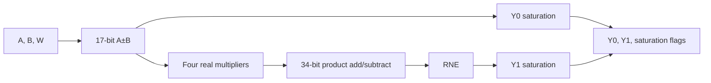

# Radix-2 Fixed-Point Butterfly

English | [简体中文](README_zh-CN.md)

A synthesizable SystemVerilog implementation of a signed Q1.15 DIF Radix-2 complex butterfly, developed as an end-to-end RTL and microarchitecture study:

```text
design intent → fixed-point model → RTL → verification
              → synthesis → place and route → timing reconstruction
```

The project compares a combinational baseline (V0) with a fixed-latency pipelined implementation (V1). Both versions implement identical bit-level arithmetic, including explicit width propagation, round-to-nearest ties-to-even, saturation, and four component-level saturation flags.

Under a controlled Nangate45/OpenROAD comparison, V1 increased the highest fully passing tested clock point from 425 MHz to 640 MHz. Both designs have an initiation interval of one cycle, so the tested peak throughput increased by approximately 50.6%. At a common 400 MHz operating point, this cost approximately 16.4% more standard-cell design area.

These figures are comparative results from an open educational PDK and an open-source physical-design flow. They are not commercial-process signoff data or measured silicon results.

## Highlights

- Signed 16-bit Q1.15 complex inputs and outputs
- DIF butterfly: `Y0 = A + B`, `Y1 = (A - B) × W`
- Explicit 17-bit add/subtract results
- Four parallel signed real multipliers
- 34-bit complex multiply-accumulate results before quantization
- Round-to-nearest, ties-to-even (RNE)
- Saturation instead of two's-complement wraparound
- Independent `sat_y0_re`, `sat_y0_im`, `sat_y1_re`, and `sat_y1_im` flags
- Combinational and pipelined RTL implementations
- Bit-exact integer Python reference model
- File-driven, self-checking SystemVerilog testbenches
- 1,071 common directed, twiddle, and reproducible random vectors
- Generic Yosys synthesis and Nangate45/OpenROAD physical implementation
- Post-route critical-path reconstruction and evidence-driven design decisions

## Mathematical Definition

The implemented DIF Radix-2 butterfly is:

```math
Y_0=A+B
```

```math
Y_1=(A-B)W
```

For complex values:

```math
Y_{1,\mathrm{re}}=(A_{\mathrm{re}}-B_{\mathrm{re}})W_{\mathrm{re}}
-(A_{\mathrm{im}}-B_{\mathrm{im}})W_{\mathrm{im}}
```

```math
Y_{1,\mathrm{im}}=(A_{\mathrm{re}}-B_{\mathrm{re}})W_{\mathrm{im}}
+(A_{\mathrm{im}}-B_{\mathrm{im}})W_{\mathrm{re}}
```

`W` is supplied externally. The datapath accepts any legal Q1.15 complex encoding and does not assume or check that `|W| = 1`.

## Fixed-Point Contract

| Node | Width | Format | Behavior |
|---|---:|---|---|
| `A`, `B`, `W` components | 16 | Q1.15 | Signed two's complement |
| `A+B`, `A-B` components | 17 | Q2.15 | Full-width add/subtract |
| Each real product | 33 | Q3.30 | Signed 17×16 multiplication |
| Complex product add/subtract | 34 | Q4.30 | Products are sign-extended before combining |
| `Y0`, `Y1` components | 16 | Q1.15 | Saturated output |

`Y0` retains 15 fractional bits, so it requires range checking and saturation but no fractional rounding.

`Y1` removes 15 fractional bits. Quantization is performed in this order:

```text
34-bit Q4.30
    → round-to-nearest, ties-to-even
    → range check at the extended width
    → saturate to 16-bit Q1.15
```

Rounding before saturation is required because rounding itself can cross a representable boundary. Saturation is checked before narrowing so that an out-of-range value cannot first wrap into an apparently legal 16-bit value.

## Microarchitectures

### V0: Combinational Baseline

`butterfly_comb` contains no clock, reset, valid state, or internal registers.



For timing and physical comparison, `butterfly_comb_eval` adds common input and output register boundaries around the unchanged core.

### V1: Fixed-Latency Pipeline

`butterfly_pipe` divides the same arithmetic across three registered stages:

| Stage | Combinational work | Registered state |
|---|---|---|
| 1 | `A+B`, `A-B` | sums, differences, aligned `W`, valid |
| 2 | four real multiplications | four products, delayed `Y0`, valid |
| 3 | product add/subtract, RNE, saturation | outputs, saturation flags, valid |


An input accepted at rising edge `t` produces its corresponding core output at rising edge `t+2`. The core initiation interval is `II=1`, so consecutive valid inputs are accepted every cycle.

Invalid input cycles propagate as bubbles. Wide data registers retain their previous values during bubbles, while valid bits continue to advance. Synchronous active-high reset clears the valid pipeline and discards in-flight transactions.

For physical comparison, `butterfly_pipe_eval` adds the same external input and output boundaries used by the V0 evaluation wrapper. Wrapper-level latency is therefore one cycle for V0 and four cycles for V1; these values must not be confused with the core latency.

## Verification

The Python reference model uses integer arithmetic only. It defines the expected output bits and saturation flags independently of RTL timing.

The default common regression contains:

| Vector group | Count |
|---|---:|
| Directed functional and boundary cases | 7 |
| Quantized twiddle cases | 64 |
| Reproducible random cases | 1,000 |
| Total | 1,071 |

The default random seed is `0xB077E2`.

V0 and V1 consume the same CSV results. The V1 testbench additionally checks:

- consecutive valid transactions at `II=1`;
- the fixed two-cycle core interval;
- bubbles and valid alignment;
- retained output data during invalid cycles;
- cleared saturation flags during invalid cycles;
- synchronous reset while transactions are in flight;
- immediate acceptance after reset release.

Both self-checking regressions pass all 1,071 vectors with no mismatches under Verilator 5.032.

### Generate the Common Vector File

Run from the repository root:

```bash
python3 model/generate_vectors.py \
  --output tb/test_vectors/butterfly_common.csv \
  --component-flags
```

### Run the V0 Regression

```bash
mkdir -p build/verilator/v0

verilator --binary --timing --Wall \
  --top-module tb_butterfly_comb \
  rtl/common/sat_q15.sv \
  rtl/common/rne_sat_q30_to_q15.sv \
  rtl/v0/butterfly_comb.sv \
  tb/v0/tb_butterfly_comb.sv \
  --Mdir build/verilator/v0

./build/verilator/v0/Vtb_butterfly_comb \
  +VECTOR_FILE=tb/test_vectors/butterfly_common.csv
```

Expected result:

```text
PASS: 1071 vectors checked with no mismatches
```

### Run the V1 Regression

```bash
mkdir -p build/verilator/v1

verilator --binary --timing --Wall \
  --top-module tb_butterfly_pipe \
  rtl/v1/butterfly_pipe.sv \
  tb/v1/tb_butterfly_pipe.sv \
  --Mdir build/verilator/v1

./build/verilator/v1/Vtb_butterfly_pipe \
  +VECTOR_FILE=tb/test_vectors/butterfly_common.csv
```

The testbench CSV reader intentionally avoids `%[^,]` scansets because Verilator 5.032 does not support that `$fscanf` format reliably.

## Generic Yosys Synthesis

The following commands run technology-independent synthesis and save the reports:

```bash
mkdir -p reports/yosys

yosys -p '
  read_verilog -sv \
    rtl/common/sat_q15.sv \
    rtl/common/rne_sat_q30_to_q15.sv \
    rtl/v0/butterfly_comb.sv;
  hierarchy -check -top butterfly_comb;
  proc; opt; check; stat;
' | tee reports/yosys/v0_generic_synthesis.log

yosys -p '
  read_verilog -sv rtl/v1/butterfly_pipe.sv;
  hierarchy -check -top butterfly_pipe;
  proc; opt; check; stat;
' | tee reports/yosys/v1_generic_synthesis.log
```

Generic cell counts are useful for understanding inferred operators and registers, but they are not physical area estimates. Standard-cell area is reported only after mapping and physical implementation.

## OpenROAD Flow

The checked-in ORFS configurations target the common 500 MHz comparison point. Start the ORFS container from the repository root so that the repository is mounted as `/work`:

```bash
/path/to/OpenROAD-flow-scripts/flow/util/docker_shell bash
```

Then run inside the container:

```bash
make DESIGN_CONFIG=/work/constraints/openroad/v0/config.mk
make DESIGN_CONFIG=/work/constraints/openroad/v1/config.mk
```

The prompt distinguishes the two path namespaces:

- on the WSL/Linux host, use repository-relative paths such as `reports/...`;
- inside the ORFS container, use mounted paths such as `/work/reports/...`.

The exact tool revisions and known netlist-parser, SDC, and peak-point CTS compatibility conditions are documented in [`05_synthesis_and_ppa_analysis.md`](docs/05_synthesis_and_ppa_analysis_EN.md). The 425 MHz and 640 MHz peak scans use separate flow variants and are intentionally not presented as the default one-command build.

## Synthesis and Physical-Design Results

### Environment

| Component | Version or configuration |
|---|---|
| RTL simulation | Verilator 5.032 |
| Local generic synthesis | Yosys 0.52 |
| ORFS synthesis | Yosys 0.68+post |
| Physical implementation | OpenROAD 26Q3-1305-gf552262465 |
| Container | `openroad/orfs:latest` |
| Platform | Nangate45, typical liberty corner |
| Nominal voltage | 1.10 V |

The V0 and V1 evaluation wrappers use the same clock definition, uncertainty, input/output delays, output load, core utilization target, and physical-flow settings.

### Common 400 MHz Operating Point

| Metric | V0 | V1 | V1 relative change |
|---|---:|---:|---:|
| Worst setup slack | +0.05 ns | +0.82 ns | +0.77 ns |
| TNS | 0.00 ns | 0.00 ns | both pass |
| Design area | 11,051 μm² | 12,859 μm² | +16.4% |
| Reported utilization | 51% | 51% | equal |
| Vectorless power estimate | 0.304 W | 0.122 W | -59.9% |
| Initiation interval | 1 | 1 | equal |
| Throughput | 400 Mops/s | 400 Mops/s | equal |

The area comparison at 400 MHz is the cleanest estimate of the normal pipeline cost because both implementations meet the same target without extreme repair pressure.

### Common 500 MHz Target

| Metric | V0 | V1 |
|---|---:|---:|
| Worst setup slack | -0.26 ns | +0.36 ns |
| TNS | -8.37 ns | 0.00 ns |
| Maximum slew/fanout/capacitance violations | 0/0/0 | 0/0/0 |
| Timing repair buffers | 1,430 | 248 |
| Result | timing failed | timing passed |

V0 completed the physical flow but did not meet the 2.000 ns clock requirement. V1 met the same target with 0.36 ns setup margin.

### Highest Fully Passing Tested Points

| Metric | V0 | V1 |
|---|---:|---:|
| Tested clock point | 425 MHz | 640 MHz |
| Worst setup slack | +0.02 ns | +0.03 ns |
| Worst hold slack | +0.06 ns | +0.02 ns |
| Peak throughput at `II=1` | 425 Mops/s | 640 Mops/s |
| Design area | 11,343 μm² | 13,116 μm² |

The tested peak clock and throughput increased by approximately 50.6%. These are the highest complete passing points in the current scan, not mathematical or signoff claims of absolute Fmax.

Peak-point runs used `SKIP_CTS_REPAIR_TIMING=1` to work around a reproducible OpenROAD `illegal instruction` during CTS timing repair. Timing repair was deferred to later stages; final post-route setup, hold, TNS, and electrical checks passed. The common 400 MHz and 500 MHz comparisons used the standard flow and were not affected by this workaround.

Power numbers are vectorless estimates. They are useful only as controlled tool outputs and must not be interpreted as measured power or as proof of realistic FFT workload energy.

## Critical-Path Reconstruction

Post-route timing reports identify different bottlenecks in the two designs.

### V0 at 425 MHz

```text
Startpoint: a_im_q[1]
Endpoint:   y1_re[8]
Arrival:    2.374 ns
Required:   2.397 ns
Slack:      +0.023 ns
```

The path crosses the complete `Y1` chain: difference generation, signed multiplication, product combination, rounding, saturation, and output capture.


The GUI correlation locates the launch register, a chain of mapped HA/FA and compound-gate cells, and the output capture register in the final routed database. The physical view supports the deep-combinational-chain explanation; it does not by itself prove that wire delay dominates cell delay.

### V1 at 640 MHz

```text
Startpoint: u_core.diff_re_s1[6]
Endpoint:   u_core.m2_s2[31]
Arrival:    1.610 ns
Required:   1.643 ns
Slack:      +0.033 ns
```

Since `m2_s2 = diff_re_s1 × w_im_s1`, the V1 bottleneck is the stage-2 signed multiplier. It does not pass through the stage-3 product combination, RNE, or saturation logic.


The routed path contains a high-fanout buffered `diff_re_s1` bit followed by HA/FA partial-product reduction and endpoint logic before `m2_s2`. This provides physical evidence that the multiplier, rather than the downstream quantization stage, is the current limiting stage.

This evidence changes the optimization decision: adding another register after the multiplier stage or splitting RNE from saturation would not shorten the current multiplier critical path. A higher-frequency successor would need to pipeline or replace the multiplier itself. That requires a target-specific pipelined multiplier/DSP, retiming support, or a new partial-product microarchitecture and is intentionally outside the current MVP.

## Design Decision

V1 is frozen as the final MVP implementation.

It meets the 500 MHz target and converts the V0 full-chain critical path into a single-multiplier critical stage. Further RTL changes are deferred until a product requirement selects a new objective:

| New objective | Candidate direction |
|---|---|
| Higher frequency | Pipeline or replace the multiplier itself |
| Lower cycle latency or clock area | Evaluate a shallower pipeline at a lower frequency target |
| Lower arithmetic area | Evaluate a three-real-multiply complex formulation |
| Specialized FFT stages | Optimize constant or restricted twiddle factors |
| Lower realistic power | Generate common VCD/SAIF activity before changing enables or gating |
| System-level streaming | Add ready/valid backpressure, buffers, drain control, and counters in a Butterfly Engine |

The project stops at the point where additional optimization would change the target problem rather than improve the current implementation against an unmet requirement.

## Repository Layout

```text
radix2-butterfly/
├── rtl/
│   ├── common/              # Reusable saturation and RNE helpers
│   ├── v0/                  # Combinational butterfly
│   ├── v1/                  # Fixed-latency pipelined butterfly
│   └── eval/                # Registered physical-evaluation wrappers
├── tb/
│   ├── v0/                  # V0 self-checking testbench
│   ├── v1/                  # V1 scoreboard-based testbench
│   └── test_vectors/        # Shared generated CSV vectors
├── model/                   # Bit-exact Python model and vector generator
├── constraints/
│   └── openroad/            # V0/V1 ORFS configuration and SDC files
├── docs/                    # Design intent through post-route reconstruction
│   └── images/              # Selected post-route timing-path screenshots
├── reports/                 # Selected reproducible report summaries
├── scripts/                 # Synthesis and reporting helpers
└── README.md
```

Generated Verilator object directories, full OpenROAD databases, routed GDS files, and other large build products should remain under ignored build/results directories rather than being committed as source.

## Documentation

The detailed engineering record is organized as a decision chain:

1. [`01_design_intent.md`](docs/01_design_intent_EN.md) — scope, goals, and exclusions
2. [`02_fixed_point_spec.md`](docs/02_fixed_point_spec_EN.md) — numerical contract and width proof
3. [`03_microarchitecture.md`](docs/03_microarchitecture_EN.md) — V0/V1 datapaths and protocol
4. [`04_verification_plan.md`](docs/04_verification_plan_EN.md) — reference model, vectors, and pass criteria
5. [`05_synthesis_and_ppa_analysis.md`](docs/05_synthesis_and_ppa_analysis_EN.md) — controlled implementation results
6. [`06_design_reconstruction.md`](docs/06_design_reconstruction_EN.md) — post-route path reconstruction and improvement decision

## Scope Boundaries

This repository implements one standalone, generic Butterfly processing element. It intentionally does not include:

- a complete FFT network;
- stage scheduling or bit reversal;
- twiddle ROM generation and addressing;
- AXI or DMA interfaces;
- backpressure or a stallable pipeline;
- multi-PE scheduling;
- product-level multi-corner signoff;
- measured silicon power or performance.

Those concerns belong to a future Butterfly Engine or FFT accelerator rather than this fixed-point datapath MVP.
