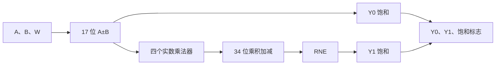

# Radix-2 定点数 Butterfly

[English](README.md) | 简体中文

这是一个可综合的 SystemVerilog 实现，用于完成有符号 Q1.15 DIF Radix-2 复数 Butterfly。项目以端到端 RTL 与微架构研究为主线：

```text
设计意图 → 定点数模型 → RTL → 验证
        → 综合 → 布局布线 → 时序重建
```

项目比较组合逻辑基线版本（V0）和固定延迟流水线版本（V1）。两个版本实现完全相同的位级算术，包括显式位宽传递、最近偶数舍入（round-to-nearest, ties-to-even）、饱和处理，以及四个分量级饱和标志。

在受控的 Nangate45/OpenROAD 对比中，V1 将完整流程通过的最高已测试时钟点从 425 MHz 提升至 640 MHz。两个设计的启动间隔均为一个周期，因此已测试峰值吞吐提高约 50.6%。在共同的 400 MHz 工作点，这一改进的代价是标准单元设计面积增加约 16.4%。

这些数字来自开放教学 PDK 和开源物理设计流程的对比结果，并非商业工艺签核数据或实测芯片结果。

## 项目亮点

- 有符号 16 位 Q1.15 复数输入和输出
- DIF Butterfly：`Y0 = A + B`，`Y1 = (A - B) × W`
- 显式 17 位加减结果
- 四个并行的有符号实数乘法器
- 量化前为 34 位复数乘加结果
- 最近偶数舍入（RNE）
- 使用饱和处理，而非二进制补码回绕
- 独立的 `sat_y0_re`、`sat_y0_im`、`sat_y1_re` 和 `sat_y1_im` 标志
- 组合逻辑与流水线两种 RTL 实现
- 位精确的整数 Python 参考模型
- 文件驱动、自检查的 SystemVerilog 测试平台
- 1,071 个共用向量，覆盖定向、旋转因子和可复现随机测试
- 通用 Yosys 综合和 Nangate45/OpenROAD 物理实现
- 布局布线后关键路径重建和基于证据的设计决策

## 数学定义

实现的 DIF Radix-2 Butterfly 为：

```math
Y_0=A+B
```

```math
Y_1=(A-B)W
```

对于复数：

```math
Y_{1,\mathrm{re}}=(A_{\mathrm{re}}-B_{\mathrm{re}})W_{\mathrm{re}}
-(A_{\mathrm{im}}-B_{\mathrm{im}})W_{\mathrm{im}}
```

```math
Y_{1,\mathrm{im}}=(A_{\mathrm{re}}-B_{\mathrm{re}})W_{\mathrm{im}}
+(A_{\mathrm{im}}-B_{\mathrm{im}})W_{\mathrm{re}}
```

`W` 由外部提供。数据通路接受任意合法的 Q1.15 复数编码，不假设也不检查 `|W| = 1`。

## 定点数约定

| 节点 | 位宽 | 格式 | 行为 |
|---|---:|---|---|
| `A`、`B`、`W` 分量 | 16 | Q1.15 | 有符号二进制补码 |
| `A+B`、`A-B` 分量 | 17 | Q2.15 | 全位宽加减 |
| 每个实数乘积 | 33 | Q3.30 | 有符号 17×16 乘法 |
| 复数乘积加减 | 34 | Q4.30 | 乘积先进行符号扩展再组合 |
| `Y0`、`Y1` 分量 | 16 | Q1.15 | 饱和输出 |

`Y0` 保留 15 个小数位，因此需要范围检查和饱和处理，但不需要小数舍入。

`Y1` 删除 15 个小数位，量化顺序如下：

```text
34 位 Q4.30
    → 最近偶数舍入
    → 在扩展位宽上检查范围
    → 饱和至 16 位 Q1.15
```

必须先舍入后饱和，因为舍入本身可能使结果越过可表示边界。必须在缩位前检查饱和，否则超范围值可能先回绕成看似合法的 16 位数值。

## 微架构

### V0：组合逻辑基线

`butterfly_comb` 不包含时钟、复位、valid 状态或内部寄存器。



为了进行时序与物理对比，`butterfly_comb_eval` 在未改动的核心外添加了统一的输入和输出寄存器边界。

### V1：固定延迟流水线

`butterfly_pipe` 将相同算术划分到三个寄存阶段：

| 阶段 | 组合逻辑工作 | 寄存状态 |
|---|---|---|
| 1 | `A+B`、`A-B` | 和、差、对齐的 `W`、valid |
| 2 | 四个实数乘法 | 四个乘积、延迟后的 `Y0`、valid |
| 3 | 乘积加减、RNE、饱和 | 输出、饱和标志、valid |


在上升沿 `t` 接收的输入，会在上升沿 `t+2` 产生对应的核心输出。核心启动间隔为 `II=1`，因此可以每周期接收一组连续有效输入。

无效输入周期以气泡形式传播。宽数据寄存器在气泡期间保持旧值，而 valid 位继续推进。同步高有效复位会清空 valid 流水线并丢弃所有在途事务。

为了进行物理对比，`butterfly_pipe_eval` 添加了与 V0 评估包装层相同的外部输入和输出边界。因此，包装层级延迟为 V0 一个周期、V1 四个周期；不要将其与核心延迟混淆。

## 验证

Python 参考模型只使用整数运算，并独立于 RTL 时序定义期望输出位和饱和标志。

默认共用回归包含：

| 向量组 | 数量 |
|---|---:|
| 定向功能与边界用例 | 7 |
| 量化旋转因子用例 | 64 |
| 可复现随机用例 | 1,000 |
| 总计 | 1,071 |

默认随机种子为 `0xB077E2`。

V0 和 V1 使用相同的 CSV 结果。V1 测试平台还检查：

- `II=1` 时的连续有效事务；
- 固定的两周期核心间隔；
- 气泡和 valid 对齐；
- 无效周期中的输出数据保持；
- 无效周期中的饱和标志清零；
- 存在在途事务时的同步复位；
- 复位释放后立即接收输入。

在 Verilator 5.032 下，两个自检查回归均通过全部 1,071 个向量且无失配。

### 生成共用向量文件

在仓库根目录运行：

```bash
python3 model/generate_vectors.py \
  --output tb/test_vectors/butterfly_common.csv \
  --component-flags
```

### 运行 V0 回归

```bash
mkdir -p build/verilator/v0

verilator --binary --timing --Wall \
  --top-module tb_butterfly_comb \
  rtl/common/sat_q15.sv \
  rtl/common/rne_sat_q30_to_q15.sv \
  rtl/v0/butterfly_comb.sv \
  tb/v0/tb_butterfly_comb.sv \
  --Mdir build/verilator/v0

./build/verilator/v0/Vtb_butterfly_comb \
  +VECTOR_FILE=tb/test_vectors/butterfly_common.csv
```

预期结果：

```text
PASS: 1071 vectors checked with no mismatches
```

### 运行 V1 回归

```bash
mkdir -p build/verilator/v1

verilator --binary --timing --Wall \
  --top-module tb_butterfly_pipe \
  rtl/v1/butterfly_pipe.sv \
  tb/v1/tb_butterfly_pipe.sv \
  --Mdir build/verilator/v1

./build/verilator/v1/Vtb_butterfly_pipe \
  +VECTOR_FILE=tb/test_vectors/butterfly_common.csv
```

测试平台的 CSV 读取器有意避免使用 `%[^,]` scanset，因为 Verilator 5.032 无法可靠支持这种 `$fscanf` 格式。

## 通用 Yosys 综合

以下命令执行与技术无关的综合并保存报告：

```bash
mkdir -p reports/yosys

yosys -p '
  read_verilog -sv \
    rtl/common/sat_q15.sv \
    rtl/common/rne_sat_q30_to_q15.sv \
    rtl/v0/butterfly_comb.sv;
  hierarchy -check -top butterfly_comb;
  proc; opt; check; stat;
' | tee reports/yosys/v0_generic_synthesis.log

yosys -p '
  read_verilog -sv rtl/v1/butterfly_pipe.sv;
  hierarchy -check -top butterfly_pipe;
  proc; opt; check; stat;
' | tee reports/yosys/v1_generic_synthesis.log
```

通用单元数量适合用来理解推断出的运算符和寄存器，但不能作为物理面积估计。只有在标准单元映射和物理实现后，才能报告标准单元面积。

## OpenROAD 流程

仓库中的 ORFS 配置以共同的 500 MHz 对比点为目标。请从仓库根目录启动 ORFS 容器，使仓库挂载为 `/work`：

```bash
/path/to/OpenROAD-flow-scripts/flow/util/docker_shell bash
```

然后在容器内运行：

```bash
make DESIGN_CONFIG=/work/constraints/openroad/v0/config.mk
make DESIGN_CONFIG=/work/constraints/openroad/v1/config.mk
```

命令提示符对应两套路径命名空间：

- 在 WSL/Linux 主机上，使用 `reports/...` 等仓库相对路径；
- 在 ORFS 容器内，使用 `/work/reports/...` 等挂载路径。

准确的工具版本以及已知的网表解析器、SDC 和峰值点 CTS 兼容性条件，记录于 [`05_synthesis_and_ppa_analysis_zh-CN.md`](docs/05_synthesis_and_ppa_analysis_zh-CN.md)。425 MHz 和 640 MHz 峰值扫描使用独立的流程变体，因此有意不将其作为默认的一键构建流程。

## 综合与物理设计结果

### 环境

| 组件 | 版本或配置 |
|---|---|
| RTL 仿真 | Verilator 5.032 |
| 本地通用综合 | Yosys 0.52 |
| ORFS 综合 | Yosys 0.68+post |
| 物理实现 | OpenROAD 26Q3-1305-gf552262465 |
| 容器 | `openroad/orfs:latest` |
| 平台 | Nangate45，typical liberty corner |
| 标称电压 | 1.10 V |

V0 和 V1 评估包装层使用相同的时钟定义、不确定度、输入/输出延迟、输出负载、核心利用率目标和物理流程设置。

### 共同的 400 MHz 工作点

| 指标 | V0 | V1 | V1 相对变化 |
|---|---:|---:|---:|
| 最差建立时间裕量 | +0.05 ns | +0.82 ns | +0.77 ns |
| TNS | 0.00 ns | 0.00 ns | 均通过 |
| 设计面积 | 11,051 μm² | 12,859 μm² | +16.4% |
| 报告利用率 | 51% | 51% | 相同 |
| 无向量功耗估计 | 0.304 W | 0.122 W | -59.9% |
| 启动间隔 | 1 | 1 | 相同 |
| 吞吐 | 400 Mops/s | 400 Mops/s | 相同 |

400 MHz 面积对比是常规流水线开销最清晰的估计，因为两个实现都能在没有极端时序修复压力的情况下满足相同目标。

### 共同的 500 MHz 目标

| 指标 | V0 | V1 |
|---|---:|---:|
| 最差建立时间裕量 | -0.26 ns | +0.36 ns |
| TNS | -8.37 ns | 0.00 ns |
| 最大转换时间/扇出/电容违例 | 0/0/0 | 0/0/0 |
| 时序修复缓冲器 | 1,430 | 248 |
| 结果 | 时序失败 | 时序通过 |

V0 完成了物理流程，但未满足 2.000 ns 时钟要求。V1 在相同目标下以 0.36 ns 建立时间裕量通过。

### 完整流程通过的最高已测试点

| 指标 | V0 | V1 |
|---|---:|---:|
| 已测试时钟点 | 425 MHz | 640 MHz |
| 最差建立时间裕量 | +0.02 ns | +0.03 ns |
| 最差保持时间裕量 | +0.06 ns | +0.02 ns |
| `II=1` 时的峰值吞吐 | 425 Mops/s | 640 Mops/s |
| 设计面积 | 11,343 μm² | 13,116 μm² |

已测试峰值时钟和吞吐提高约 50.6%。这些是当前扫描中完整流程通过的最高点，并非对绝对 Fmax 的数学证明或签核声明。

峰值点运行使用 `SKIP_CTS_REPAIR_TIMING=1`，以绕过 OpenROAD 在 CTS 时序修复期间可复现的 `illegal instruction`。时序修复被延后至后续阶段；最终布局布线后的建立时间、保持时间、TNS 和电气检查均通过。共同的 400 MHz 和 500 MHz 对比使用标准流程，不受此变通方案影响。

功耗数字是无向量估计，只能作为受控的工具输出使用，不能解释为实测功耗，也不能证明真实 FFT 工作负载下的能效。

## 关键路径重建

布局布线后的时序报告表明，两个设计的瓶颈不同。

### V0 @ 425 MHz

```text
Startpoint: a_im_q[1]
Endpoint:   y1_re[8]
Arrival:    2.374 ns
Required:   2.397 ns
Slack:      +0.023 ns
```

该路径穿过完整的 `Y1` 链：差值生成、有符号乘法、乘积组合、舍入、饱和和输出捕获。


GUI 对照定位了最终布线数据库中的发射寄存器、由映射后的 HA/FA 和复合门单元组成的链，以及输出捕获寄存器。物理视图支持“深组合逻辑链”的解释，但本身不能证明线延迟占主导。

### V1 @ 640 MHz

```text
Startpoint: u_core.diff_re_s1[6]
Endpoint:   u_core.m2_s2[31]
Arrival:    1.610 ns
Required:   1.643 ns
Slack:      +0.033 ns
```

由于 `m2_s2 = diff_re_s1 × w_im_s1`，V1 的瓶颈是第二级有符号乘法器。该路径不会经过第三级乘积组合、RNE 或饱和逻辑。


布线路径包含经过缓冲的高扇出 `diff_re_s1` 位，随后是 HA/FA 部分积归约以及 `m2_s2` 前的终点逻辑。这为“乘法器而非后续量化级是当前限制级”提供了物理证据。

这些证据改变了优化决策：在乘法器级之后再添加寄存器，或把 RNE 与饱和拆开，都无法缩短当前的乘法器关键路径。更高频率的后续版本必须对乘法器本身进行流水化或替换。这需要面向目标的流水乘法器/DSP、重定时支持或新的部分积微架构，有意超出当前 MVP 范围。

## 设计决策

V1 冻结为最终 MVP 实现。

它满足 500 MHz 目标，并将 V0 的全链关键路径转化为单个乘法器关键级。进一步 RTL 修改将延后，直到产品需求选定新的优化目标：

| 新目标 | 候选方向 |
|---|---|
| 更高频率 | 对乘法器本身进行流水化或替换 |
| 更低周期延迟或时钟面积 | 在较低频率目标下评估更浅的流水线 |
| 更低算术面积 | 评估三实数乘法的复数乘法结构 |
| 专用 FFT 级 | 优化常量或受限旋转因子 |
| 更低的真实功耗 | 在修改使能或门控前生成共用 VCD/SAIF 活动 |
| 系统级流处理 | 在 Butterfly Engine 中添加 ready/valid 反压、缓冲、排空控制和计数器 |

项目停在这样一个节点：继续优化将改变目标问题，而不是解决当前实现尚未满足的需求。

## 仓库结构

```text
radix2-butterfly/
├── rtl/
│   ├── common/              # 可复用的饱和与 RNE 辅助模块
│   ├── v0/                  # 组合逻辑 Butterfly
│   ├── v1/                  # 固定延迟流水线 Butterfly
│   └── eval/                # 带寄存边界的物理评估包装层
├── tb/
│   ├── v0/                  # V0 自检查测试平台
│   ├── v1/                  # 基于 scoreboard 的 V1 测试平台
│   └── test_vectors/        # 共用生成 CSV 向量
├── model/                   # 位精确 Python 模型和向量生成器
├── constraints/
│   └── openroad/            # V0/V1 ORFS 配置和 SDC 文件
├── docs/                    # 从设计意图到布局布线后重建的文档
│   └── images/              # 精选的布局布线后时序路径截图
├── reports/                 # 精选的可复现报告摘要
├── scripts/                 # 综合与报告辅助脚本
└── README.md
```

生成的 Verilator 对象目录、完整 OpenROAD 数据库、布线后 GDS 文件和其他大型构建产物，应保留在被忽略的 build/results 目录中，而不是作为源文件提交。

## 文档

详细工程记录按决策链组织：

1. [`01_design_intent_zh-CN.md`](docs/01_design_intent_zh-CN.md) — 范围、目标和排除项
2. [`02_fixed_point_spec_zh-CN.md`](docs/02_fixed_point_spec_zh-CN.md) — 数值约定和位宽证明
3. [`03_microarchitecture_zh-CN.md`](docs/03_microarchitecture_zh-CN.md) — V0/V1 数据通路和协议
4. [`04_verification_plan_zh-CN.md`](docs/04_verification_plan_zh-CN.md) — 参考模型、向量和通过标准
5. [`05_synthesis_and_ppa_analysis_zh-CN.md`](docs/05_synthesis_and_ppa_analysis_zh-CN.md) — 受控的实现结果
6. [`06_design_reconstruction_zh-CN.md`](docs/06_design_reconstruction_zh-CN.md) — 布局布线后路径重建和改进决策

## 范围边界

本仓库实现一个独立、通用的 Butterfly 处理单元，特意不包括：

- 完整 FFT 网络；
- 级调度或位反转；
- 旋转因子 ROM 生成与寻址；
- AXI 或 DMA 接口；
- 反压或可停顿流水线；
- 多 PE 调度；
- 产品级多角签核；
- 实测芯片功耗或性能。

这些内容属于未来的 Butterfly Engine 或 FFT 加速器，而不是当前定点数数据通路 MVP。
