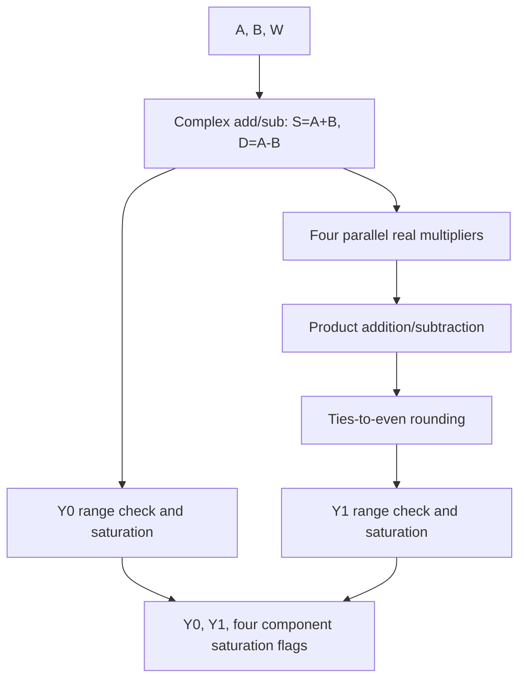

# Radix-2 Butterfly MVP: Microarchitecture Specification

## 1. Purpose

This document maps the functional objectives in `01_design_intent_EN.md` and the numerical rules in `02_fixed_point_spec_EN.md` into datapaths, module boundaries, interfaces, and evaluation structures.

It freezes:

- combinational V0;
- a four-real-multiplier complex multiply;
- Y0/Y1 datapaths and intermediate widths;
- a V0 core without clock, reset, or `valid`;
- separate synchronous evaluation wrappers;
- a three-stage fixed-latency V1 pipeline;
- V1 valid, bubble, reset, and output-retention semantics; and
- the fair-comparison method.

V1 is the first pipeline derived from arithmetic boundaries and evaluated physically. Current evidence supports its ability to shorten the worst combinational path but does not prove global optimality. Later repartitioning requires a new version.

## 2. Version and Module Hierarchy

| Layer | Module | Role | Status |
|---|---|---|---|
| V0 core | `butterfly_comb` | Portable combinational Butterfly | Implemented and bit-exact verified |
| V1 core | `butterfly_pipe` | Three-stage fixed-latency pipeline | Implemented; numerical and protocol verification passed |
| V0 wrapper | `butterfly_comb_eval` | Common input/output register boundaries | Implemented and physically evaluated |
| V1 wrapper | `butterfly_pipe_eval` | Equivalent external register boundaries | Implemented and physically evaluated |

The `*_eval` modules exist only for synthesis, timing, and physical comparison. They preserve core numerical behavior. Wrapper registers must not be described as internal V0 pipeline stages.

## 3. V0 Top-Level Behavior

### 3.1 Function

```math
Y_0=A+B,\qquad Y_1=(A-B)W
```

Stable inputs produce stable outputs after combinational propagation. V0 retains no state and defines no result cycle.

### 3.2 Timing Properties

`butterfly_comb` has no `clk`, `rst`, `valid_in`, `valid_out`, or registers. Outputs may glitch while inputs propagate, so the consumer must sample only after settling. The valid-interface requirement applies to clocked V1 and synchronous evaluation, with combinational V0 as an explicit exception.

### 3.3 Datapath Overview



## 4. V0 Interface

All data ports are signed two's-complement Q1.15.

### 4.1 Inputs

| Port | Direction | Width | Meaning |
|---|---|---:|---|
| `a_re`, `a_im` | input | 16 | Real/imaginary `A` |
| `b_re`, `b_im` | input | 16 | Real/imaginary `B` |
| `w_re`, `w_im` | input | 16 | Real/imaginary `W` |

### 4.2 Outputs

| Port | Direction | Width | Meaning |
|---|---|---:|---|
| `y0_re`, `y0_im` | output | 16 | Quantized real/imaginary `Y_0` |
| `y1_re`, `y1_im` | output | 16 | Quantized real/imaginary `Y_1` |
| `sat_y0_re`, `sat_y0_im` | output | 1 | Actual clamping of each Y0 component |
| `sat_y1_re`, `sat_y1_im` | output | 1 | Actual clamping of each Y1 component |

Flags follow `02_fixed_point_spec_EN.md`: they indicate actual out-of-range clamping, not general precision loss or merely equaling a boundary. Aggregate information may be OR-reduced externally.

## 5. Internal Datapath

### 5.1 Add/Subtract Stage

Inputs are sign-extended before computing:

```math
S_{\mathrm{re}}=A_{\mathrm{re}}+B_{\mathrm{re}},\quad
S_{\mathrm{im}}=A_{\mathrm{im}}+B_{\mathrm{im}}
```

```math
D_{\mathrm{re}}=A_{\mathrm{re}}-B_{\mathrm{re}},\quad
D_{\mathrm{im}}=A_{\mathrm{im}}-B_{\mathrm{im}}
```

All four results are signed 17-bit Q2.15. RTL controls extension explicitly rather than relying on expression-context width.

### 5.2 Y0 Path

The sums already have 15 fractional bits. Each is range-checked without rounding: clamp above 32767, clamp below -32768, otherwise retain the low 16-bit in-range value. Components emit independent flags.

### 5.3 Four Parallel Real Multipliers

```math
M_0=D_{\mathrm{re}}W_{\mathrm{re}},\quad
M_1=D_{\mathrm{im}}W_{\mathrm{im}},\quad
M_2=D_{\mathrm{re}}W_{\mathrm{im}},\quad
M_3=D_{\mathrm{im}}W_{\mathrm{re}}
```

All four multipliers exist concurrently and are not time-multiplexed. Each product is signed 33-bit Q3.30. V0 does not use a three-multiply complex formulation because that would introduce different add/subtract ranges and error paths, confounding the pipeline comparison.

### 5.4 Product Combination

```math
P_{\mathrm{re}}=M_0-M_1,\qquad P_{\mathrm{im}}=M_2+M_3
```

Each 33-bit product is explicitly sign-extended to 34 bits before combination. Results remain signed Q4.30 until quantization. The extra bit protects against premature SystemVerilog expression overflow; it is not a claim of additional fractional precision.

### 5.5 Y1 Rounding and Saturation

Each component follows:

```math
\text{34-bit Q4.30}
\rightarrow
\text{RNE ties-to-even}
\rightarrow
\text{range check}
\rightarrow
\text{16-bit Q1.15 saturation}
```

Rounding observes the retained value, 15 discarded bits, exact-half condition, retained LSB, and sign. The implementation uses the two's-complement `guard/sticky/kept_lsb` rule and must not depend on host-language defaults. Saturation flags are determined independently after rounding.

## 6. Width Summary

| Node | Count | Width | Format | Next operation |
|---|---:|---:|---|---|
| Input components | 6 | 16 | signed Q1.15 | Add/subtract or multiply input |
| `S_re,S_im` | 2 | 17 | signed Q2.15 | Y0 saturation |
| `D_re,D_im` | 2 | 17 | signed Q2.15 | Four multipliers |
| `M_0`–`M_3` | 4 | 33 | signed Q3.30 | Extend and combine |
| `P_re,P_im` | 2 | 34 | signed Q4.30 | RNE and saturation |
| Output components | 4 | 16 | signed Q1.15 | Module outputs |
| Component flags | 4 | 1 | logic | Module outputs |

## 7. Combinational Organization Rules

V0 may use one top-level combinational process or reusable add/subtract, rounding, and saturation helpers. Either form must preserve the same synthesized behavior.

Requirements:

- declare arithmetic signals signed;
- explicitly control operand widths before add/subtract and product combination;
- do not replace saturation with low-16-bit slicing;
- do not replace ties-to-even with unconditional half-LSB addition;
- do not instantiate vendor DSP/multiplier/saturation primitives;
- do not add multiplier sharing, FSMs, or multicycle control;
- do not add vector-specific constant assumptions; and
- do not depend on `|W| = 1` for correctness.

Whether helpers such as `sat_q15` are separate modules is code organization, not a new microarchitecture.

## 8. Synchronous Evaluation Wrappers

### 8.1 Purpose

V0 port-to-port delay is not directly comparable to pipelined register-to-register `F_max`. `butterfly_comb_eval` and `butterfly_pipe_eval` provide equivalent external register boundaries so the implementation flow compares each design's worst registered path.


The primary timing condition is:

```math
T_{\mathrm{clk\text{-}to\text{-}Q}}+T_{\mathrm{comb}}+T_{\mathrm{setup}}\le T_{\mathrm{clk}}
```

### 8.2 Responsibilities

Both wrappers sample six inputs on a common edge, feed registered data to the core, capture four outputs and four component flags, align valid information, and preserve otherwise-unused outputs against optimization.

They must not change numerical rules, insert registers into V0, replace/share multipliers, add backpressure, or be reported as core resources without qualification.

### 8.3 Frozen Wrapper Protocol

Both wrappers use synchronous active-high reset:

- reset clears valid state and four saturation flags;
- wide data registers need not reset;
- invalid inputs form bubbles while wide input/output registers retain values;
- invalid output cycles clear four saturation flags;
- `butterfly_comb_eval` input-edge-to-output-valid latency is one cycle;
- `butterfly_pipe_eval` latency is four cycles; and
- both retain `II=1`.

The four V1-wrapper cycles comprise one external input boundary, two core cycles, and one external output boundary. This does not change the V1 core's two-cycle definition.

## 9. Fair V0/V1 Comparison

### 9.1 Functional and Evaluation Fairness

Both cores share the four-multiplier arithmetic, 34-bit Q4.30 quantization input, RNE-then-saturate policy, component flags, and 17-column vectors. Ignoring fixed latency, corresponding valid transactions must match bit for bit.

Physical fairness comes from the two wrappers and common OpenROAD constraints: same library, flow, SDC, and external boundaries. Power remains vectorless and therefore lacks workload activity evidence.

### 9.2 Comparison Boundary

V0 is evaluated from common input registers through the complete Butterfly to common output registers. V1 uses equivalent external boundaries and retains internal pipeline registers. Therefore V0's critical path spans the full combinational Butterfly, V1's critical path is its slowest internal stage, and V1's additional resources and latency must be reported.

### 9.3 Fixed Conditions

Hold constant the ASIC library/PVT corner, tool/version, synthesis and physical stages, clock-constraint method, arithmetic/fixed-point behavior, four-multiplier structure, mapping strategy, external boundaries, optimization level, and key options.

Record multiplier mapping, automatic retiming, register replication or logic restructuring, constant propagation, and unused-logic removal. Any automatic register movement/addition must be disclosed before frequency gains are attributed to manual stage boundaries.

### 9.4 Required Metrics

| Metric | Definition |
|---|---|
| `F_max` | Highest passing frequency under stated conditions |
| Critical path | Worst registered path and arithmetic nodes |
| Cycle latency `L` | Accepted input to corresponding valid output |
| Absolute latency | `L/F_max` |
| Initiation interval `II` | Minimum transaction spacing |
| Peak throughput | `F_max/II` transactions/s |
| Arithmetic resources | Standard cells, combinational area, equivalent resources |
| Register resources | External-boundary and internal-pipeline registers separately |
| Control complexity | Valid alignment, reset, and verification burden |

Higher `F_max` alone does not establish overall superiority.

## 10. Model, RTL, and Testbench Responsibilities

| Component | Answers | Does not answer |
|---|---|---|
| Python model | Correct output bits and flags for an input | Frequency, gate delay, pipeline cycles |
| RTL | Hardware organization and result timing | Independent golden answers |
| Testbench | Which output matches which input and whether bits match | New rounding or saturation definitions |

V0 is checked after combinational settling. V1 enqueues the Python expectation when an input is accepted and compares it when `valid_out` arrives. The common 17-column CSV contains six inputs, four outputs, two derived aggregate flags, four component flags, and one label.

## 11. Critical-Path Hypothesis and Evidence

The original V0 worst-path candidate was:

```math
\text{input register}
\rightarrow
\text{17-bit subtract}
\rightarrow
\text{33-bit multiply}
\rightarrow
\text{34-bit combine}
\rightarrow
\text{RNE}
\rightarrow
\text{saturation}
\rightarrow
\text{output register}
```

Y0 was expected to be shorter because it contains only add and saturation. Post-route evidence supports greater passing frequency and common-frequency margin for V1. Exact values and limitations are in `05_synthesis_and_ppa_analysis_EN.md`.

Implementation analysis records endpoints, arithmetic logic, multiplier mapping, whether rounding/saturation enters the critical path, and Y0/Y1 margin differences. Evidence evaluates the frozen partition; it does not retroactively redefine it.

## 12. V1 Three-Stage Pipeline

### 12.1 Stage Partition

| Stage | Combinational work | Registered at stage end |
|---|---|---|
| 1 | `S=A+B`, `D=A-B` | `sum_*_s1`, `diff_*_s1`, `w_*_s1`, `valid_s1` |
| 2 | Four parallel real multiplications | `m0_s2`–`m3_s2`, `sum_*_s2`, `valid_s2` |
| 3 | 34-bit combination, Y1 RNE, four saturations | Four outputs, four flags, `valid_out` |

`W` must be registered in stage 1 to prevent `diff_A` from pairing with `W_B`. Wide Y0 sums bypass stage-2 arithmetic through `sum_*_s2`, rejoining the same transaction's Y1 in stage 3.

### 12.2 Latency, II, and Throughput

For a transaction satisfying `rst=0 && valid_in=1` at edge `t`:

- it enters stage 1 at `t`;
- stage 2 at `t+1`; and
- writes output registers with `valid_out=1` at `t+2`.

Under the input-edge-to-output-valid-edge convention:

```math
L=2\ \text{cycles},\qquad II=1\ \text{cycle}
```

Peak throughput is one Butterfly transaction per cycle, or `f_clk` transactions/s.

### 12.3 Valid and Bubbles

V1 has no `ready`, backpressure, stall, or bubble compression:

```systemverilog
valid_s1  <= valid_in;
valid_s2  <= valid_s1;
valid_out <= valid_s2;
```

Invalid-slot data may participate in downstream combinational evaluation but has no protocol meaning. Correctness requires that each stage combine only transaction-aligned data and delay valid through the same boundaries.

### 12.4 Reset

Reset is synchronous and active high. A rising edge with `rst=1` clears `valid_s1`, `valid_s2`, `valid_out`, and four output saturation flags, discarding all in-flight transactions. Wide data registers need not reset because they have no meaning when invalid. A new valid transaction may enter on the first edge after reset deassertion.

### 12.5 Invalid Output Cycles

Only `valid_out=1` authorizes consumption. When `valid_s2=0`, stage 3 retains four output data registers, writes four flags to zero, and drives `valid_out=0`. Downstream logic must qualify every flag with `valid_out`.

### 12.6 RTL Assignment Discipline

Inter-stage registers use nonblocking `<=` in `always_ff`, so each stage observes the previous state from before the edge. Intra-stage rounding/range/saturation combinational dependencies use blocking `=` in `always_comb`. Process count or source-code length does not create stages; only register boundaries change cycle latency.

## 13. Frozen Conclusions

1. `butterfly_comb` is a stateless combinational V0 core without clock, reset, or valid.
2. Y0 is complex addition followed by range check and saturation.
3. Y1 is complex subtraction, four real multiplications, product combination, RNE, and saturation.
4. Widths are 17-bit Q2.15, 33-bit Q3.30, and 34-bit Q4.30 through quantization.
5. Four component saturation flags are core outputs; aggregates are external reductions.
6. The two evaluation wrappers add equivalent external boundaries only for fair physical analysis.
7. V0 and V1 share numerical behavior, multiplier structure, library, flow, constraints, and evaluation boundaries.
8. The Python model defines values, RTL defines structure/timing, and testbenches map transactions.
9. V1 is a three-stage fixed-latency pipeline with two-cycle core latency, `II=1`, synchronous active-high reset, and no backpressure.
10. Both cores, wrappers, self-checking testbenches, and fair ASIC comparisons are complete; evidence is in `04_verification_plan_EN.md` and `05_synthesis_and_ppa_analysis_EN.md`.
