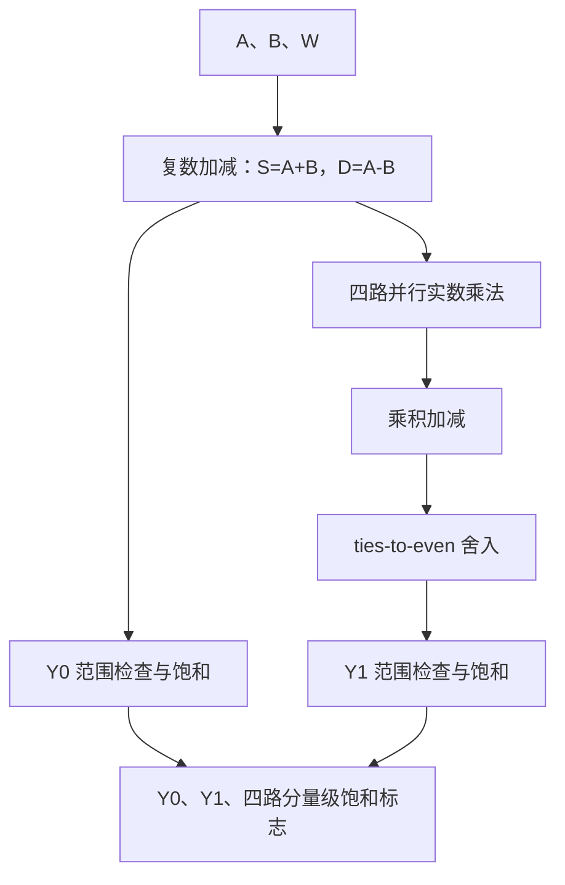

# Radix-2 Butterfly MVP：微架构规格

## 1. 文档目的

本文档将 `01_design_intent.md` 中的功能目标和 `02_fixed_point_spec.md` 中的数值规则映射为具体的数据通路、模块边界、接口与评测结构。

本文档当前冻结以下内容：

- V0 采用纯组合微架构；
- 复数乘法采用四个实数乘法器并行实现；
- $Y_0$ 与 $Y_1$ 的数据通路及中间位宽；
- V0 核心模块不包含时钟、复位或 `valid`；
- 使用独立的同步评测包装层建立寄存器到寄存器的时序边界；
- V1 采用三级固定延迟流水结构；
- V1 的 `valid`、气泡、复位和输出保持语义；
- V0 与后续流水版的公平比较方法。

V1 是首个依据算术边界构造并完成评测的流水版本。当前综合与布局布线结果支持该切分能够缩短最慢组合路径，但不能证明它是全局最优结构。后续修改必须形成新版本，不得静默改变本文冻结的 V1 定义。

## 2. 版本与模块分层

MVP 将功能核心、评测边界和后续流水实现分开，避免把数学运算、接口协议与实验设施混为同一个模块。

| 层次 | 建议模块名 | 定位 | 当前状态 |
|---|---|---|---|
| V0 功能核心 | `butterfly_comb` | 纯组合、平台无关的 Butterfly 数据通路 | 已实现并通过位精确验证 |
| V1 流水核心 | `butterfly_pipe` | 三级固定延迟流水版本 | 已实现并通过位精确与时序协议验证 |
| V0 评测包装层 | `butterfly_comb_eval` | 为 V0 增加统一输入、输出寄存器边界 | 已实现并完成 ASIC 实现评测 |
| V1 评测包装层 | `butterfly_pipe_eval` | 为 V1 增加相同的外部寄存器边界 | 已实现并完成 ASIC 实现评测 |

`butterfly_comb` 和 `butterfly_pipe` 是功能核心。两个 `*_eval` 模块只用于综合、时序和物理实现比较；它们不改变核心数值行为。包装层资源必须与核心内部资源在解释上区分，不能将 `butterfly_comb_eval` 的边界寄存器称为 V0 内部流水。

## 3. V0 顶层行为

### 3.1 功能

V0 实现 DIF Radix-2 Butterfly：

$$
Y_0=A+B
$$

$$
Y_1=(A-B)W
$$

对于任意一组稳定输入，输出在组合传播延迟后稳定。V0 不保存历史状态，也不定义“第几拍产生结果”。

### 3.2 时序属性

`butterfly_comb` 不包含：

- `clk`；
- `rst`；
- `valid_in`；
- `valid_out`；
- 输入、输出或内部流水寄存器。

因此，V0 的输出可能在输入切换后的组合传播过程中出现短暂毛刺。使用者必须在输出稳定后采样；V0 本身不提供输出稳定指示。

`01_design_intent.md` 中的 `valid_in/valid_out` 要求适用于时钟驱动的流水版本与同步评测环境。纯组合 V0 没有事务状态，是该接口要求的明确例外。

### 3.3 组合路径概览



## 4. V0 接口

所有数据端口均使用有符号二进制补码。输入与输出格式统一为 16 位 Q1.15。

### 4.1 输入端口

| 端口 | 方向 | 位宽 | 格式 | 含义 |
|---|---|---:|---|---|
| `a_re` | input | 16 | signed Q1.15 | $A$ 的实部 |
| `a_im` | input | 16 | signed Q1.15 | $A$ 的虚部 |
| `b_re` | input | 16 | signed Q1.15 | $B$ 的实部 |
| `b_im` | input | 16 | signed Q1.15 | $B$ 的虚部 |
| `w_re` | input | 16 | signed Q1.15 | $W$ 的实部 |
| `w_im` | input | 16 | signed Q1.15 | $W$ 的虚部 |

### 4.2 输出端口

| 端口 | 方向 | 位宽 | 格式 | 含义 |
|---|---|---:|---|---|
| `y0_re` | output | 16 | signed Q1.15 | 量化后 $Y_0$ 的实部 |
| `y0_im` | output | 16 | signed Q1.15 | 量化后 $Y_0$ 的虚部 |
| `y1_re` | output | 16 | signed Q1.15 | 量化后 $Y_1$ 的实部 |
| `y1_im` | output | 16 | signed Q1.15 | 量化后 $Y_1$ 的虚部 |
| `sat_y0_re` | output | 1 | logic | $Y_0$ 实部实际被饱和 |
| `sat_y0_im` | output | 1 | logic | $Y_0$ 虚部实际被饱和 |
| `sat_y1_re` | output | 1 | logic | $Y_1$ 实部实际被饱和 |
| `sat_y1_im` | output | 1 | logic | $Y_1$ 虚部实际被饱和 |

四个标志的定义以 `02_fixed_point_spec.md` 为准。标志表示对应分量确实越界并被钳位，不表示一般精度损失，也不表示结果只是恰好等于边界。需要聚合信息时可在接口外对四个标志进行归约或。

## 5. 内部数据通路

### 5.1 加减级

首先对输入分量进行符号扩展，再完成复数和与复数差：

$$
S_{\mathrm{re}}=A_{\mathrm{re}}+B_{\mathrm{re}}
$$

$$
S_{\mathrm{im}}=A_{\mathrm{im}}+B_{\mathrm{im}}
$$

$$
D_{\mathrm{re}}=A_{\mathrm{re}}-B_{\mathrm{re}}
$$

$$
D_{\mathrm{im}}=A_{\mathrm{im}}-B_{\mathrm{im}}
$$

四个结果均使用 17 位 signed Q2.15。RTL 必须显式保证 16 位输入在运算前完成正确的符号扩展，不能依赖容易产生歧义的表达式上下文位宽。

### 5.2 $Y_0$ 路径

$S_{mathrm{re}}$ 和 $S_{mathrm{im}}$ 已经具有 15 个小数位，因此不需要舍入。每个分量直接执行 Q1.15 范围检查：

- 大于 `32767` 时输出 `32767`；
- 小于 `-32768` 时输出 `-32768`；
- 否则无损保留为 16 位。

两个分量分别输出 `sat_y0_re` 与 `sat_y0_im`，不在核心接口中提前聚合。

### 5.3 四路并行实数乘法

复数乘法采用直接展开的四乘法器结构：

$$
M_0=D_{mathrm{re}}W_{mathrm{re}}
$$

$$
M_1=D_{mathrm{im}}W_{mathrm{im}}
$$

$$
M_2=D_{mathrm{re}}W_{mathrm{im}}
$$

$$
M_3=D_{mathrm{im}}W_{mathrm{re}}
$$

四个乘法同时存在于硬件中，不进行分时复用。每个乘积为 33 位 signed Q3.30。

V0 不采用三乘法复数乘法公式。三乘法结构会引入额外加减、不同中间范围和不同误差路径，无法只研究流水边界带来的影响。V0 与首个 V1 应保持同样的四乘法算术结构。

### 5.4 乘积加减

宽位复数乘法结果为：

$$
P_{\mathrm{re}}=M_0-M_1
$$

$$
P_{\mathrm{im}}=M_2+M_3
$$

每个 33 位乘积必须先显式符号扩展到 34 位，再完成加减。结果保持为 34 位 signed Q4.30，直接进入后续舍入和饱和逻辑，不提前缩窄。

该 34 位运算不是额外的数值精度要求，而是避免 SystemVerilog 隐式表达式位宽导致中间结果提前溢出。

### 5.5 $Y_1$ 舍入与饱和

$P_{mathrm{re}}$ 和 $P_{mathrm{im}}$ 从 34 位 Q4.30 量化为 Q1.15。每个分量严格执行：

$$
\text{34 位 Q4.30}
\rightarrow
\text{round-to-nearest, ties-to-even}
\rightarrow
\text{范围检查}
\rightarrow
\text{16 位 Q1.15 饱和输出}
$$

舍入逻辑必须同时观察：

- 被保留部分；
- 被删除 15 位是否小于、等于或大于半个目标 LSB；
- 恰好半格时最低保留位是否为 1；
- 原数的符号。

负数行为必须与 `02_fixed_point_spec.md` 中的数学定义逐位一致。当前实现使用二进制补码 `guard/sticky/kept_lsb` 判定并对有符号基值加一；不能直接依赖宿主语言或工具对负数右移、截断和舍入的默认行为。

两个分量在舍入后分别判断是否实际越界，并分别输出 `sat_y1_re` 与 `sat_y1_im`。

## 6. 位宽与节点汇总

| 节点 | 数量 | 位宽 | 格式 | 后续操作 |
|---|---:|---:|---|---|
| 输入分量 | 6 | 16 | signed Q1.15 | 加减或乘法输入 |
| $S_{mathrm{re}},S_{mathrm{im}}$ | 2 | 17 | signed Q2.15 | $Y_0$ 饱和 |
| $D_{mathrm{re}},D_{mathrm{im}}$ | 2 | 17 | signed Q2.15 | 四路乘法 |
| $M_0$ 至 $M_3$ | 4 | 33 | signed Q3.30 | 显式扩展后加减 |
| $P_{mathrm{re}},P_{mathrm{im}}$ | 2 | 34 | signed Q4.30 | ties-to-even 与饱和 |
| 输出分量 | 4 | 16 | signed Q1.15 | 模块输出 |
| 分量级饱和标志 | 4 | 1 | logic | 模块输出 |

## 7. 组合逻辑组织原则

V0 可以在一个顶层组合过程内描述，也可以拆成加减、舍入和饱和等可复用组合子模块。无论采用何种代码组织方式，综合后的逻辑语义必须与本章数据通路一致。

实现必须遵守以下原则：

- 所有算术信号明确声明为有符号类型；
- 在加减和乘积合并前显式控制操作数位宽；
- 不用直接截取低 16 位代替饱和；
- 不用简单加半个 LSB 代替 ties-to-even；
- 不实例化厂商专有 DSP、乘法器或饱和原语；
- 不加入乘法器复用、状态机或多周期控制；
- 不加入只为某一组测试向量成立的常量化假设；
- 正常功能不得依赖 $|W|=1$。

是否将 `sat_q15` 或 `rne_q30_to_q15` 实现为独立模块，属于 RTL 代码组织选择，不改变微架构版本定义。

## 8. 同步评测包装层

### 8.1 目的

纯组合 V0 的端口到端口传播延迟不能直接与流水版的寄存器到寄存器 $F_{\max}$ 比较。`butterfly_comb_eval` 和 `butterfly_pipe_eval` 为两个核心提供相同类型的外部输入、输出寄存器边界，使实现工具比较各自最慢的寄存器到寄存器路径。


其主要时序约束为：

$$
T_{\mathrm{clk\text{-}to\text{-}Q}}
+T_{\mathrm{comb}}
+T_{\mathrm{setup}}
\le
T_{\mathrm{clk}}
$$

### 8.2 包装层职责

两个包装层共同负责：

- 在统一时钟边沿采样六个输入分量；
- 将已寄存的输入送入 `butterfly_comb`；
- 在后续时钟边沿采样四个输出分量及四个分量级饱和标志；
- 在需要进行连续事务验证时，使有效信息与对应数据保持一致；
- 防止综合工具将未使用输出优化掉。

包装层不得：

- 修改定点数值规则；
- 在 V0 核心内部插入寄存器；
- 复用或替换四个乘法器；
- 添加背压；
- 被计入 V0 核心的逻辑资源而不单独说明。

### 8.3 已冻结的包装层协议

两个包装层均采用同步、高电平复位，并遵守以下规则：

- 复位时清零有效位和四个饱和标志；
- 宽数据寄存器不要求复位；
- 无效输入形成气泡，宽输入和输出数据寄存器保持前值；
- 无效输出拍将四个饱和标志清零；
- `butterfly_comb_eval` 的输入采样沿到输出有效沿间隔为 1 个周期；
- `butterfly_pipe_eval` 的输入采样沿到输出有效沿间隔为 4 个周期；
- 两个包装层均保持 $II=1$。

V1 包装层的 4 周期包括 1 个外部输入边界、V1 核心的 2 周期延迟以及 1 个外部输出边界。该延迟只用于评测接口，不改变 `butterfly_pipe` 核心自身的 2 周期延迟定义。

## 9. V0 与 V1 的公平比较

### 9.1 功能公平与评测公平

当前已经建立的是功能公平：V0 和 V1 使用相同的四乘法算术结构、34 位 Q4.30 量化输入、RNE 后饱和规则和四路分量级饱和接口，并由同一套 17 列向量检查。V0 组合输出与 V1 对应有效事务在忽略固定流水延迟后必须逐位一致。

综合与时序公平由两个已实现的 `*_eval` 包装层和共同的 OpenROAD 约束建立。共同测试向量证明数值与接口可比；相同工艺库、工具流程、SDC 和外部边界使 PPA 对比具有一致实验口径。功耗仍是 vectorless 估计，不具有真实工作负载活动率证据。

### 9.2 比较边界

V0 的评测对象是“统一输入寄存器 → 完整组合 Butterfly → 统一输出寄存器”。V1 也必须使用等价的外部同步边界，但允许在核心算术路径内部增加流水寄存器。

因此：

- V0 的关键路径覆盖完整 Butterfly 组合逻辑；
- V1 的关键路径是最慢的内部流水级；
- 两者的端口约束与外部寄存器边界保持一致；
- 内部流水寄存器增加的资源和周期延迟必须明确报告。

### 9.3 固定实验条件

比较两版时必须保持：

- 同一 ASIC 工艺库与 PVT 角；
- 同一综合工具与版本；
- 同一综合及布局布线阶段；
- 同一时钟约束方法；
- 同一算术定义和定点行为；
- 同样的四乘法器并行结构；
- 同样的标准单元映射和乘法逻辑实现策略；
- 同样的输入、输出同步边界；
- 同样的优化等级与关键综合选项。

必须记录工具是否进行了：

- 乘法器如何映射为目标库组合逻辑；
- 自动重定时；
- 寄存器复制或逻辑重构；
- 常量传播与未使用逻辑删除。

如果工具自动移动或增加寄存器，必须在结果中说明；否则无法把频率变化可靠地归因于手工选择的流水边界。

### 9.4 必须同时报告的指标

| 指标 | 定义 |
|---|---|
| $F_{\max}$ | 在指定器件、工具和约束下满足时序的最高频率 |
| 关键路径 | 最慢寄存器到寄存器路径及其经过的算术节点 |
| 周期延迟 $L$ | 一组被接收输入到对应有效输出之间的周期数 |
| 绝对延迟 | $L/F_{\max}$ |
| 启动间隔 $II$ | 相邻输入事务允许的最小周期数 |
| 峰值吞吐率 | $F_{\max}/II$ 组事务每秒 |
| 算术资源 | 标准单元、组合逻辑面积及工具报告的等效资源 |
| 寄存器资源 | 外部边界寄存器与内部流水寄存器分别统计 |
| 控制复杂度 | `valid` 对齐、复位及新增状态的验证负担 |

不得仅凭更高的 $F_{\max}$ 宣称 V1 整体更优。流水化可能提高频率和稳态吞吐率，同时增加 FF、周期延迟、绝对延迟和验证复杂度。

## 10. Python模型、RTL与测试平台的职责

三者职责严格分离：

| 部分 | 回答的问题 | 不负责的内容 |
|---|---|---|
| Python 位精确模型 | 对给定输入，正确输出比特和饱和标志是什么 | 时钟频率、门延迟、流水周期 |
| RTL 微架构 | 数学运算如何映射为组合或流水硬件，结果何时出现 | 生成独立的黄金答案 |
| 测试平台 | 哪组输出对应哪组输入，是否逐位匹配 | 重新定义舍入或饱和规则 |

对于 V0，测试平台在输入稳定并等待足够组合仿真时间后比较结果。对于 V1，测试平台应在输入事务被接收时将 Python 期望结果放入记分板，并在对应 `valid_out` 到达时比较。

当前共同 CSV 向量包含 17 列：6 个输入、4 个输出、`y0_sat/y1_sat` 两个派生聚合标志、4 个分量级标志和 1 个用例标签。V0 和 V1 均以四个分量级标志为核心判定；测试平台同时检查两个聚合字段是否等于对应分量标志的归约或，以保持旧向量消费者的兼容性。

## 11. 关键路径假设与实现证据

设计前提出的 V0 候选最长路径为：

$$
\text{输入寄存器}
\rightarrow
\text{17 位减法}
\rightarrow
\text{33 位乘法}
\rightarrow
\text{34 位乘积加减}
\rightarrow
\text{ties-to-even}
\rightarrow
\text{饱和}
\rightarrow
\text{输出寄存器}
$$

$Y_0$ 路径只经过 17 位加法和饱和，因此预期短于 $Y_1$ 路径。当前布局布线结果支持三级 V1 相比 V0 获得更高的通过频率和更大的共同频率时序裕量，但本文件不复制具体数值；完整数据、工具条件和限制见 `05_synthesis_and_ppa_analysis.md`。

解释实现报告时仍需记录：

- 最慢路径起点和终点；
- 路径经过的主要算术逻辑；
- 乘法是否映射到 DSP；
- 舍入或饱和是否进入关键路径；
- $Y_0$ 与 $Y_1$ 路径的时序裕量差异。

这些证据用于判断 V1 的切分是否有效，并决定是否需要形成新的后续版本；它们不能用于事后改写 V1 的既定定义。

## 12. V1 三级流水规格

### 12.1 流水级划分

| 流水级 | 本级组合计算 | 本级末端寄存内容 |
|---|---|---|
| 第一级 | $S=A+B$、$D=A-B$ | `sum_*_s1`、`diff_*_s1`、`w_*_s1`、`valid_s1` |
| 第二级 | 四路并行实数乘法 | `m0_s2` 至 `m3_s2`、`sum_*_s2`、`valid_s2` |
| 第三级 | 34 位乘积加减、$Y_1$ ties-to-even、四路饱和 | 四路输出数据、四个分量级饱和标志、`valid_out` |

第一级必须同时寄存 $W$，防止连续事务中出现 `diff_A` 与 `W_B` 错配。$Y_0$ 的宽位和虽然不参与第二级乘法，仍必须通过 `sum_*_s2` 旁路延迟一拍，使事务 A 的 $Y_0$ 与事务 A 的 $Y_1$ 在第三级重新汇合。

### 12.2 延迟、启动间隔与吞吐率

若事务在第 $t$ 个上升沿满足 `rst=0 && valid_in=1`，则：

- 第 $t$ 个上升沿进入第一级；
- 第 $t+1$ 个上升沿进入第二级；
- 第 $t+2$ 个上升沿写入输出寄存器，且 `valid_out=1`。

因此，本项目按“输入被采样的上升沿到输出有效上升沿之间的间隔”定义：

$$
L=2\ \text{个周期}
$$

$$
II=1\ \text{个周期}
$$

峰值吞吐率为每周期一个 Butterfly 事务；若工作频率为 $f_{\mathrm{clk}}$，则为 $f_{\mathrm{clk}}$ 个事务每秒。

### 12.3 `valid` 与气泡

V1 不支持 `ready`、背压、流水暂停或气泡压缩。`valid_in=0` 的输入拍形成气泡，并与数据槽位一样逐级传播：

```systemverilog
valid_s1  <= valid_in;
valid_s2  <= valid_s1;
valid_out <= valid_s2;
```

无效拍中的数据可以参与后级组合计算，但因对应 `valid=0` 而不具有协议意义。不同输入事务彼此没有数据依赖；功能正确性的前提是每一级只组合同一事务中已经对齐的数据，并使 `valid` 经历相同数量的寄存边界。

### 12.4 复位语义

V1 使用同步、高电平复位 `rst`。在上升沿采到 `rst=1` 时：

- 清零 `valid_s1`、`valid_s2` 和 `valid_out`，丢弃流水线内全部未完成事务；
- 清零四个输出饱和标志；
- 宽数据寄存器不要求复位，因为 `valid=0` 时其内容无协议意义。

在复位解除后的第一个上升沿，只要 `valid_in=1`，输入即可立即进入第一级，不需要额外等待一拍。

### 12.5 无效输出周期

只有 `valid_out=1` 时，输出数据和饱和标志才可被消费。第三级在 `valid_s2=0` 时：

- 保持四路输出数据寄存器不变，以减少无效拍引起的宽数据寄存器翻转；
- 将四个饱和标志写为 0，使波形和事件统计更直观；
- 将 `valid_out` 写为 0。

下游仍必须以 `valid_out && sat_*` 判断有效事务的饱和事件，不能脱离 `valid_out` 单独消费标志。

### 12.6 RTL 赋值纪律

所有级间寄存器在 `always_ff` 中使用非阻塞赋值 `<=`，使同一上升沿的各级读取更新前的旧级状态。舍入、范围比较和饱和等级内组合依赖在 `always_comb` 中使用阻塞赋值 `=`。代码行数或组合过程数量不增加流水级；只有寄存器边界改变周期延迟。

## 13. 当前冻结结论

截至本版文档，Microarchitecture 决策如下：

1. `butterfly_comb` 是无状态、无时钟、无复位、无 `valid` 的纯组合 V0 核心。
2. $Y_0$ 路径为复数加法后直接范围检查和饱和。
3. $Y_1$ 路径为复数减法、四路并行实数乘法、乘积加减、ties-to-even 舍入和饱和。
4. 加减结果为 17 位 Q2.15，单个乘积为 33 位 Q3.30，乘积加减结果保持为 34 位 Q4.30 直到量化。
5. 核心输出四个分量级饱和标志；聚合标志可由上层按需组合。
6. `butterfly_comb_eval` 和 `butterfly_pipe_eval` 为两版增加相同类型的外部输入、输出寄存器，只用于综合、时序与物理实现的公平评测。
7. V0 与 V1 保持相同数值规则、四乘法结构、工艺库、工具流程、约束和外部评测边界。
8. Python 模型定义正确结果，RTL 定义硬件结构与结果时刻，测试平台负责事务对应。
9. V1 为三级固定延迟流水：输入采样到输出有效间隔为 2 个周期，$II=1$，同步高电平复位，不支持背压或气泡压缩。
10. V0、V1、两个评测包装层、SystemVerilog 自检测试和公平 ASIC 实现比较均已完成；结果和证据边界分别见 `04_verification_plan.md` 与 `05_synthesis_and_ppa_analysis.md`。
