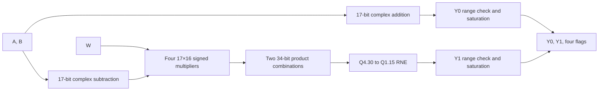
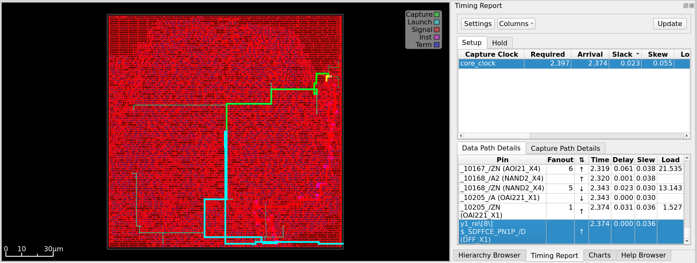
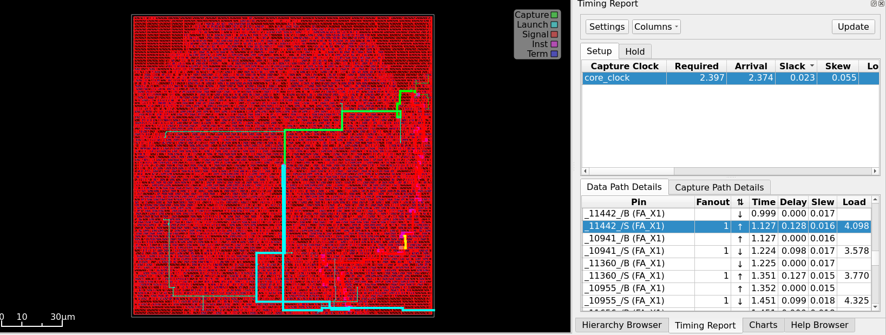
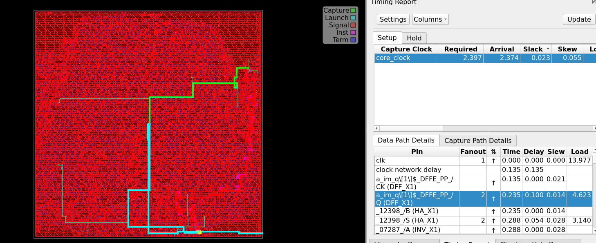
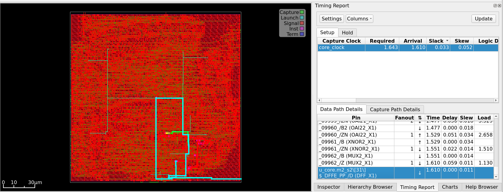
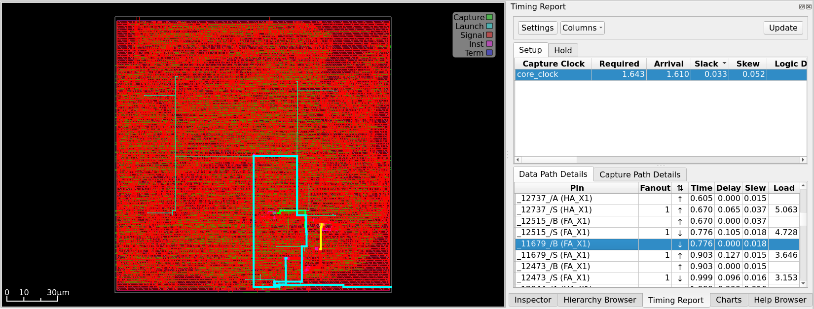
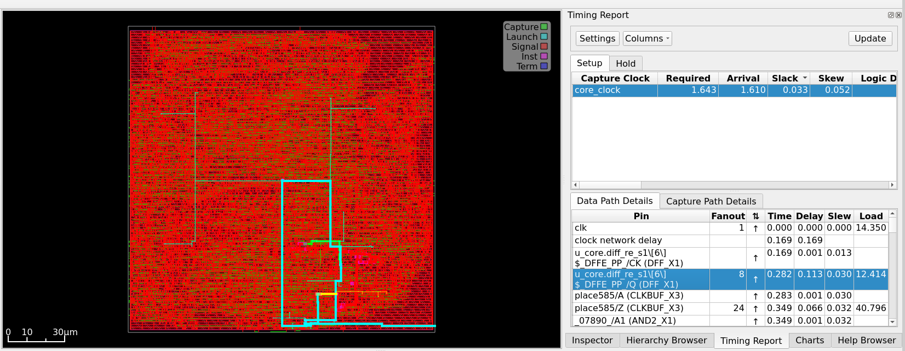

# Radix-2 Butterfly MVP: Design Reconstruction and Improvement Decisions

## 1. Purpose

This document reconstructs the hardware formed by V0 and V1 from the functional specification, RTL, generic synthesis, Nangate45 post-route STA, and final physical database. It identifies the hardware nodes created by the mathematical and fixed-point rules, explains V0's high-frequency limitation, shows which paths V1's registers break, locates V1's current critical stage, separates evidence from interpretation, and decides whether to freeze V1 or build another version.

Anonymous mapped cells are not forced into exact one-to-one RTL meanings. Synthesis and physical optimization flatten hierarchy, rewrite Boolean logic, insert buffers, and change local structure. Directly observable endpoints, nets, and reports are treated as established facts; topology-based explanations are identified as interpretations; unimplemented alternatives remain candidates.

## 2. Evidence and Applicability

### 2.1 Sources

- `01_design_intent_EN.md` through `05_synthesis_and_ppa_analysis_EN.md`;
- `butterfly_comb.sv` and `butterfly_pipe.sv`;
- post-route `6_finish.rpt` setup/hold reports;
- `6_report.log` area and cell statistics; and
- `6_final.odb`, final SDC, and extracted SPEF loaded into OpenROAD GUI.

### 2.2 Critical-Path Samples

| Design | Point | Path type | Setup slack |
|---|---:|---|---:|
| V0 | 425 MHz | Worst overall and worst register-to-register path | +0.023 ns |
| V1 | 640 MHz | Worst overall and worst register-to-register path | +0.033 ns |

For both peak implementations, the worst overall path is also the worst register-to-register path, so external port delays are not the limiting paths.

### 2.3 Limits

- 425 and 640 MHz are the highest fully passing tested points, not absolute Fmax.
- Results use Nangate45 typical corner and the stated OpenROAD flow.
- Peak points use `SKIP_CTS_REPAIR_TIMING=1` to bypass a native crash; final setup, hold, and electrical checks pass.
- One worst setup path per version does not describe every pipeline stage.
- Power is vectorless and does not establish workload activity.

## 3. From Mathematics to Hardware

```math
Y_0=A+B,\qquad Y_1=(A-B)W
```



### 3.1 Width-Driven Hardware Cost

| Node | Width/format | Hardware implication |
|---|---|---|
| Input | 16-bit Q1.15 | Input registers or combinational ports |
| Complex sum/difference | 17-bit Q2.15 | Two adders and two subtractors |
| Four real products | 33-bit Q3.30 | Four 17×16 signed multiplier networks |
| Product combinations | 34-bit Q4.30 | One wide subtractor and one wide adder |
| RNE | Discard 15 LSBs | guard, sticky, retained LSB, conditional increment |
| Saturation | Q1.15 bounds | Comparators and output selection |

The 34-bit intermediate is a deliberate protection bit: both 33-bit products are sign-extended before combination so SystemVerilog cannot overflow before quantization.

## 4. V0 Reconstruction

### 4.1 RTL Structure

`butterfly_comb` is combinational. `butterfly_comb_eval` creates the physical timing boundary:


V0 has no internal register boundary, so the complete Y1 chain must propagate within one cycle.

### 4.2 Reported Worst Path

| Attribute | V0 @ 425 MHz |
|---|---|
| Startpoint | `a_im_q[1]$_DFFE_PP_` |
| Endpoint | `y1_re[8]$_SDFFCE_PN1P_` |
| Arrival | 2.374 ns |
| Required | 2.397 ns |
| Setup slack | +0.023 ns |
| Type | Register-to-register |

Because `Y1_re = (A_re - B_re) × W_re - (A_im - B_im) × W_im`, an `a_im`-to-`y1_re` path necessarily traverses imaginary subtraction, multiplication, real-product combination, and quantization. This confirms the limiting path is the full Y1 chain rather than Y0.



The GUI view correlates the red data path with launch and capture clock paths in the final routed database.

### 4.3 Mapped-Cell Interpretation

The path contains half adders, inverters, AOI/OAI logic, multiple full/half adders, inserted buffers, OR/NOR/mux logic, and the `y1_re[8]` output flop. The front is consistent with subtraction and partial-product control, the middle with multiplier compression and wide arithmetic, and the tail with rounding/range/saturation or register-enable selection. Flattening prevents exact boundaries from anonymous names alone.



Representative consecutive FA increments are 0.128, 0.098, 0.127, and 0.099 ns. The bottleneck is cumulative arithmetic depth, not one abnormal gate.



The launch clock-to-Q increment is about 0.100 ns and Q data departs at 0.235 ns. The representative Q-to-D propagation is therefore `2.374 - 0.235 = 2.139 ns`.

### 4.4 Why V0 Is Frequency Limited

One cycle contains:

```text
subtract → multiply → product combine → RNE → saturation → output register
```

At 500 MHz, V0 has -0.26 ns WNS and -8.37 ns TNS even after 1,430 repair buffers. The issue is architectural combinational depth relative to the target, not merely a missing buffer.

## 5. V1 Reconstruction

### 5.1 Pipeline Boundaries


Core input-edge-to-output-valid-edge latency is two cycles; wrapper latency is four; initiation interval is one.

### 5.2 Reported Worst Path

| Attribute | V1 @ 640 MHz |
|---|---|
| Startpoint | `u_core.diff_re_s1[6]$_DFFE_PP_` |
| Endpoint | `u_core.m2_s2[31]$_DFFE_PP_` |
| Arrival | 1.610 ns |
| Required | 1.643 ns |
| Setup slack | +0.033 ns |
| Type | Register-to-register |

Because `m2_s2 = diff_re_s1 × w_im_s1`, the worst path is the stage-2 17×16 signed multiplier, not stage-3 combination/RNE/saturation.



The final physical path directly connects adjacent stage-1 and stage-2 registers and does not cross the stage-3 boundary.

### 5.3 Mapped Multiplier Evidence

The path contains a high-fanout buffer, HA/FA cells, AND/AOI/OAI/XNOR logic, a final mux, and the `m2_s2[31]` product register. No dedicated multiply macro appears; Nangate45 standard cells implement partial-product generation, compression, and endpoint logic.



Representative FA increments of 0.105, 0.127, and 0.096 ns provide direct physical evidence of partial-product reduction.



`diff_re_s1[6]` Q has fanout 8 and load 12.414. The tool then uses a `CLKBUF_X3` as a data buffer to drive fanout 24 and load 40.796. Its name does not make it part of the clock tree; it lies on the data path. Q arrives at 0.282 ns, so representative Q-to-D propagation is `1.610 - 0.282 = 1.328 ns`.

### 5.4 What Pipelining Solved

V1 retains all four multipliers and the same numerical algorithm. Registers prevent these chains from sharing one cycle:

```text
A-B with multiplication
multiplication with product combination
product combination with RNE and saturation
```

The full V0 chain becomes three timing stages, moving the bottleneck to the heaviest single operation: one 17×16 multiply. This explains the 640 versus 425 MHz tested points, direct throughput gain at equal `II=1`, 337 extra sequential cells, larger clock network, and lower high-frequency repair pressure.

## 6. Area and Physical Reconstruction

### 6.1 Fair 400 MHz Point

| Metric | V0 | V1 | Interpretation |
|---|---:|---:|---|
| Design area | 11,051 μm² | 12,859 μm² | V1 +16.4% |
| Sequential cells | 166 | 503 | Internal pipeline state |
| Clock buffers | 17 | 116 | Greater clock load |
| Timing-repair buffers | 418 | 238 | Shorter combinational stages |
| Multi-input combinational | 4403 | 4707 | Mapping/control differences |

Pipelining changes the optimization problem, so area is not a simple register addition.

### 6.2 Why 500 MHz Is Not a Pure Area Premium

At 500 MHz, failing V0 receives 1,430 repair buffers and reaches 12,474 μm², while passing V1 uses 248 and reaches 12,872 μm². The apparent 3.2% difference includes V0's failed-closure cost. Use 16.4% at 400 MHz for normal pipeline area cost.

## 7. Critical-Path Conclusions

### 7.1 Established Facts

- V0 runs from an `a_im` wrapper register to a `y1_re` output register through the full Y1 chain.
- V1 runs from `diff_re_s1` to `m2_s2` through a stage-2 signed multiplier.
- V1's worst path excludes stage-3 RNE and saturation.
- GUI inspection locates launch, HA/FA intermediate cells, and capture in final physical implementation.
- V1's high-fanout source and inserted data buffer are on the multiplier path.
- In both peak runs, the worst overall path is register-to-register; the external wrapper is not the primary limit.

Representative Q-to-D propagation is 2.139 ns for V0 and 1.328 ns for V1, a 37.9% reduction for these two particular paths. This is not a universal pipeline-gain constant across paths, seeds, corners, or processes.

### 7.2 Reasonable but Unproven

- V0's higher vectorless power may reflect glitch propagation.
- Exact imbalance among all three V1 stages is not quantified by one path.
- The worst bit/cell chain may move under another seed, PVT corner, or library.
- Passing beyond 640 MHz requires new experiments and cannot be extrapolated from +0.033 ns.

## 8. Improvement Requires an Objective

V1 meets 500 MHz and passes the tested 640 MHz point. Any change must first specify whether the objective is higher frequency, lower cycle latency, lower area, specialized FFT use, realistic power, or system streaming. These objectives lead to different architectures.

## 9. Candidate Improvements

### 9.1 A: Freeze V1

V1 already passes the stated target, retains `II=1`, has bit-exact verification, and has physically explained critical paths. Freezing avoids expanding scope without an unmet requirement. This is the selected MVP decision.

### 9.2 B: Add a Register After Stage 3

This would not shorten the present `diff_re_s1`-to-`m2_s2` multiplier path. It would add latency, registers, clock load, reset/valid state, and verification work. It becomes relevant only if a future multiplier change moves the bottleneck into stage 3.

### 9.3 C: Shallower Pipeline

A two-stage or otherwise shallower design could reduce register/clock area and cycle latency at a lower frequency target. It is a different area/latency objective, not an automatic improvement over V1, and requires a new version and fair PPA run.

### 9.4 D: Pipeline the Multiplier

This is the only additional pipeline direction that directly attacks the current critical path. Options include a target-specific pipelined multiplier/DSP macro, retiming, or an explicit partial-product pipeline. It changes core latency, valid alignment, register count, multiplier architecture, and verification expectations and is outside this MVP.

### 9.5 E: Three-Real-Multiply Complex Formulation

Replacing four real multiplications with three may reduce multiplier area but adds pre/post adders, changes intermediate ranges and quantization paths, and may put a pre-adder on the multiplier critical path. It requires a new fixed-point derivation, bit-exact model, vectors, and PPA experiment.

### 9.6 F: Twiddle Specialization

Constant or restricted twiddles may simplify multiplication but change the generic PE with externally supplied `W` into an FFT-stage-specific unit. This is valid only under a new product scope.

### 9.7 G: Register Enables and Power Strategy

The current design suppresses some invalid-cycle state changes, but vectorless power cannot prove workload savings. Before adding clock gating or more enable logic, use common VCD/SAIF because extra gating can increase area, clock complexity, and timing pressure.

## 10. Recommended Plan

### 10.1 MVP Decision

Freeze V1 because it meets 500 MHz, reaches the tested 640 MHz point, maintains `II=1`, and converts the full Y1 path into a single multiplier stage at a measured area/latency cost.

### 10.2 Optional Post-Release Experiments

Only under a stated new objective: activity-driven power, multiplier pipelining for higher frequency, shallower pipeline for lower latency/clock area, or three-multiply arithmetic for area.

### 10.3 Admission Criteria for a New Version

A V2 must state a measurable requirement, preserve or deliberately revise the numerical contract, update reference model and verification, use fair wrappers/constraints, and report benefits plus costs. An intuitive RTL edit without an unmet requirement is insufficient.

## 11. Final Conclusion

V0's critical path spans the complete Y1 arithmetic chain from an `a_im` input register to a `y1_re` output register. V1's three registered boundaries separate subtraction, multiplication, and quantization, reducing the worst stage to one 17×16 signed multiplier. At a common 400 MHz point this costs about 16.4% area; the highest fully passing tested point rises from 425 to 640 MHz, producing about 50.6% greater peak throughput at `II=1`.

Post-route physical inspection supports the endpoint and HA/FA-path interpretation and rejects one intuitive change: further splitting product combination, RNE, and saturation cannot shorten the current multiplier path. A genuinely higher-frequency successor must split or replace the multiplier itself; a shallower version pursues a different area/latency objective. The evidence therefore supports freezing V1 as the final MVP.
