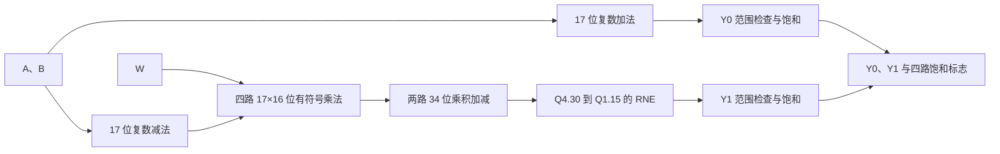

# Radix-2 Butterfly MVP：设计重建与改进决策

## 1. 文档目的

本文档根据功能规格、RTL 微架构、通用综合结果以及 Nangate45 布局布线后的静态时序报告，反向重建 V0 与 V1 最终形成的硬件结构，并回答以下问题：

1. 数学与定点规则最终形成了哪些硬件节点；
2. V0 为什么在高频下受限；
3. V1 的流水边界切断了哪些路径；
4. V1 当前真正的关键级位于哪里；
5. 哪些改进具有报告证据，哪些仍是假设；
6. 是否应继续实现新版本，或在当前 MVP 冻结 V1。

本文档不把综合后的匿名标准单元名称强行解释为精确 RTL 节点。综合和物理优化会展平层次、重写布尔逻辑、插入缓冲器并改变局部结构。能够由端点、网名和报告直接确认的内容标为“已建立事实”；需要从路径拓扑推断的内容标为“解释”；尚未运行实验的内容标为“候选方案”。

## 2. 证据来源与适用范围

### 2.1 设计证据

- `01_design_intent.md`：功能边界和评价目标；
- `02_fixed_point_spec.md`：Q 格式、位宽、RNE 和饱和规则；
- `03_microarchitecture.md`：V0、V1 和评测包装层结构；
- `04_verification_plan.md`：位精确与时序协议验证；
- `05_synthesis_and_ppa_analysis.md`：工具、约束与 PPA 数据；
- `butterfly_comb.sv`、`butterfly_pipe.sv`：源 RTL；
- `6_finish.rpt`：布局布线后建立与保持路径；
- `6_report.log`：面积和单元类型统计；
- `6_final.odb`、最终 SDC 与 SPEF：OpenROAD GUI 中的单元、布线与关键路径物理定位。

### 2.2 本次关键路径样本

| 设计 | 实验点 | 路径类型 | 建立裕量 |
|---|---:|---|---:|
| V0 | 425 MHz | 最差整体路径与最差寄存器到寄存器路径 | +0.02 ns |
| V1 | 640 MHz | 最差整体路径与最差寄存器到寄存器路径 | +0.03 ns |

两版的最差整体路径与最差寄存器到寄存器路径分别相同，说明在这两个峰值实现中，外部输入延迟和输出延迟没有成为最差建立路径。

### 2.3 证据限制

- 425 MHz 和 640 MHz 是本轮扫描中最高完整通过的测试点，不是绝对 Fmax；
- 峰值实验使用 Nangate45 典型角和当前 OpenROAD 流程；
- 极限点使用 `SKIP_CTS_REPAIR_TIMING=1` 绕过工具原生崩溃，最终建立、保持和电气检查仍通过；
- 当前只分析每版报告中的一条最差建立路径，不能据此给出全部流水级的完整延迟分布；
- 功耗仍是 vectorless 估计，不能用来证明真实 FFT 工作负载下的翻转行为。

## 3. 从数学到硬件数据通路

MVP 实现：

```math
Y_0=A+B
```

```math
Y_1=(A-B)W
```

硬件数据通路可以重建为：



### 3.1 位宽如何形成硬件成本

| 节点 | 位宽与格式 | 主要硬件含义 |
|---|---|---|
| 输入分量 | 16 位 Q1.15 | 输入寄存器或组合输入 |
| 复数和、差 | 17 位 Q2.15 | 两路加法器和两路减法器 |
| 四个实数乘积 | 33 位 Q3.30 | 四个 17×16 位有符号乘法网络 |
| 乘积加减 | 34 位 Q4.30 | 一路宽减法器和一路宽加法器 |
| RNE | 删除 15 个低位 | guard、sticky、最低保留位和条件进位逻辑 |
| 饱和 | Q1.15 范围 | 上下界比较与输出选择逻辑 |

34 位中间结果不是随意增加的保护位。它保证两个 33 位乘积在显式符号扩展后完成完整加减，避免 SystemVerilog 表达式在量化前提前溢出。

## 4. V0 设计重建

### 4.1 RTL 结构

`butterfly_comb` 本身是纯组合核心。公平评估时，`butterfly_comb_eval` 在核心前后加入寄存器：


V0 没有内部寄存器边界，因此完整的 Y1 组合链必须在一个时钟周期内传播完毕。

### 4.2 报告直接确认的最差路径

| 属性 | V0 @ 425 MHz |
|---|---|
| 起点 | `a_im_q[1]$_DFFE_PP_` |
| 终点 | `y1_re[8]$_SDFFCE_PN1P_` |
| 数据到达时间 | 2.374 ns |
| 数据要求时间 | 2.397 ns |
| 报告建立裕量 | +0.023 ns |
| 路径性质 | 寄存器到寄存器 |

起点位于包装层保存的 `a_im`，终点位于 `y1_re` 输出寄存器。根据数学关系：

```math
Y_{1,\mathrm{re}}=(A_{\mathrm{re}}-B_{\mathrm{re}})W_{\mathrm{re}}-(A_{\mathrm{im}}-B_{\mathrm{im}})W_{\mathrm{im}}
```

`a_im` 到 `y1_re` 必须经过虚部差值、相关乘法、实部乘积合并以及量化输出逻辑。因此，这条路径确认 V0 的瓶颈位于完整 Y1 算术链，而不是较短的 Y0 加法路径。


上图来自最终 ODB、SDC 与 SPEF 加载后的 OpenROAD GUI。红色数据路径连接包装层输入寄存器与 `y1_re[8]` 输出寄存器；青色和绿色分别表示发射与捕获时钟路径。

### 4.3 标准单元路径解释

路径中依次出现：

- 半加器、反相器、AOI/OAI 等逻辑；
- 多级全加器和半加器；
- 布局及重缓冲单元；
- OR、NOR、MUX 和末端组合逻辑；
- `y1_re[8]` 输出触发器。

结合端点与 RTL，可以合理解释为：

1. 前部逻辑形成差值及乘法部分积控制；
2. 中部多级全加器链完成乘法部分积压缩及后续宽位算术；
3. 末端 OR/MUX/复合门参与舍入、范围判断、饱和选择或寄存器使能选择。

由于综合后层次被展平，不能仅凭匿名单元 `_07288_` 或 `_10164_` 精确划定“乘法结束”和“RNE 开始”的边界。若需要精确对应，应保存层次、输出带源属性的网表，或在 OpenSTA 中对指定 RTL 端点和 through 节点生成路径报告。


物理检查在路径中定位到连续的 `FA_X1`。例如 `_11442_/S` 的单级增量延迟为 0.128 ns，随后还有 0.098 ns、0.127 ns 和 0.099 ns 等连续全加器级。它说明瓶颈来自多级算术逻辑的累计，而不是某一个异常门。


起点 `a_im_q[1]` 的 clock-to-Q 增量约为 0.100 ns，Q 端数据约在 0.235 ns 发出。由此到终点 D 的寄存器间数据传播区间约为 `2.374 - 0.235 = 2.139 ns`。

### 4.4 V0 高频受限原因

V0 的功能正确性没有问题。它在 425 MHz 下接近时序边界，是因为一个周期内必须完成：

```text
减法 → 乘法 → 乘积加减 → RNE → 饱和 → 输出寄存
```

在 500 MHz 的 2.000 ns 目标下，同一结构最终建立裕量为 -0.26 ns，TNS 为 -8.37 ns。工具插入 1430 个时序修复缓冲器后仍无法收敛，说明问题不是单个缺失缓冲器，而是组合逻辑深度相对于目标周期过长。

## 5. V1 设计重建

### 5.1 流水边界

V1 将同一数学函数拆为三个寄存阶段：


V1 核心的输入采样沿到核心输出有效沿间隔为 2 周期；评测包装层顶层的总延迟为 4 周期；两者的启动间隔均为 1。

### 5.2 报告直接确认的最差路径

| 属性 | V1 @ 640 MHz |
|---|---|
| 起点 | `u_core.diff_re_s1[6]$_DFFE_PP_` |
| 终点 | `u_core.m2_s2[31]$_DFFE_PP_` |
| 数据到达时间 | 1.610 ns |
| 数据要求时间 | 1.643 ns |
| 报告建立裕量 | +0.033 ns |
| 路径性质 | 寄存器到寄存器 |

根据 RTL：

```math
m2\_s2=diff\_re\_s1\times w\_im\_s1
```

因此，V1 的最差路径明确位于第二级的 17×16 位有符号乘法，而不是第三级的乘积加减、RNE 或饱和逻辑。


最终物理路径直接连接 `diff_re_s1[6]` 与 `m2_s2[31]`，没有进入第三级寄存器边界之后的乘积加减、RNE 或饱和逻辑。

### 5.3 标准单元路径解释

路径从 `diff_re_s1[6]` 出发，经过：

- 一个高扇出缓冲节点；
- 多级全加器和半加器；
- AND、AOI/OAI、XNOR 等部分积与符号处理逻辑；
- 末端 MUX；
- `m2_s2[31]` 乘积寄存器。

这与组合乘法器被映射为部分积生成、部分积压缩和末端选择逻辑的结构一致。报告没有显示专用乘法宏；当前 Nangate45 实现使用标准单元构造乘法网络。


路径中定位到 `HA_X1` 和连续 `FA_X1`，其中代表性全加器增量延迟为 0.105 ns、0.127 ns 和 0.096 ns。这是标准单元乘法器部分积归约网络的直接物理证据。


`diff_re_s1[6]` 的 Q 端扇出为 8、负载为 12.414，随后工具使用一个 `CLKBUF_X3` 作为数据缓冲器，将信号分发到扇出 24、负载 40.796 的乘法部分积逻辑。单元名包含 `CLKBUF` 不表示它在此处属于时钟树；它位于关键数据路径中。起点 Q 的到达时间为 0.282 ns，因此到终点 D 的数据传播区间约为 `1.610 - 0.282 = 1.328 ns`。

### 5.4 流水化实际解决了什么

V1 没有减少四个乘法器，也没有改变数值算法。它通过寄存器边界阻止以下逻辑在同一周期串联：

```text
A-B 与乘法串联
乘法与乘积加减串联
乘积加减与RNE、饱和串联
```

因此，V0 的“完整 Y1 链”被拆成三个独立时序级。峰值瓶颈随后转移到本身最重的单级运算——17×16 位乘法。

这解释了为什么：

- V1 最高测试通过工作点达到 640 MHz；
- V0 最高测试通过工作点为 425 MHz；
- 两版 II 都为 1，频率提高直接转化为约 50.6% 的峰值吞吐提高；
- V1 增加 337 个时序单元和更多时钟缓冲器；
- V1 在相同高频约束下减少了对跨长组合链进行修复的压力。

## 6. 面积与物理实现重建

### 6.1 400 MHz 公平工作点

| 指标 | V0 | V1 | 解释 |
|---|---:|---:|---|
| 设计面积 | 11,051 μm² | 12,859 μm² | V1 增加约 16.4% |
| 时序单元 | 166 | 503 | V1 增加内部流水状态 |
| 时钟缓冲器 | 17 | 116 | V1 的时钟负载更大 |
| 时序修复缓冲器 | 418 | 238 | V1 的组合级更短 |
| 多输入组合单元 | 4403 | 4707 | 映射和控制逻辑有所增加 |

V1 的面积不是“V0 面积加全部新增寄存器面积”的简单相加。流水改变了时序优化问题，工具会重新选择门尺寸、缓冲器和局部逻辑结构。

### 6.2 500 MHz 不能作为纯面积代价

500 MHz 时，V0 为追赶无法满足的目标插入 1430 个时序修复缓冲器，面积升至 12,474 μm²；V1 通过时序且仅有 248 个时序修复缓冲器。此时两者面积只差 3.2%，但这个数字混入了 V0 的失败收敛成本。

因此，描述流水的正常面积代价时应优先引用 400 MHz 的约 16.4%，而不是 500 MHz 的 3.2%。

## 7. 关键路径结论

### 7.1 已建立事实

- V0 峰值最差路径从 `a_im` 输入寄存器到 `y1_re` 输出寄存器；
- V0 的最差路径跨越完整 Y1 算术链；
- V1 峰值最差路径从 `diff_re_s1` 到 `m2_s2`；
- V1 的最差路径是第二级 17×16 位乘法；
- V1 的最差路径不经过第三级 RNE 或饱和逻辑；
- OpenROAD GUI 已将两版关键路径的起点、中间 HA/FA 单元和终点定位到最终物理实现；
- V1 起点高扇出数据节点及其缓冲器位于乘法关键路径中；
- 两版峰值最差整体路径都等于最差寄存器到寄存器路径；
- 外部评测包装层不是本次峰值的主要限制因素。

V0 与 V1 的代表性关键路径从起点 Q 到终点 D 分别约为 2.139 ns 和 1.328 ns，后者对这两条实际路径缩短约 37.9%。该比例只描述当前两个峰值实现中的代表路径，不能外推为所有路径或所有工艺条件下的固定流水收益。

### 7.2 合理解释但尚未完全证明

- V0 vectorless 功耗较高可能与长组合链中的毛刺传播有关；
- V1 乘法级与其他两级之间的精确不平衡程度尚未量化，因为当前只提取了一条最差路径；
- 更换实现种子、PVT 角或标准单元库后，最差乘法位和具体门链可能改变；
- 640 MHz 以上是否仍能通过，需要新的频率点实验，不能由 +0.03 ns 裕量直接外推。

## 8. 改进目标必须先于改进方案

当前 V1 已满足 500 MHz，并在本轮扫描中通过 640 MHz。继续修改前必须先指定目标：

| 目标 | 当前主要矛盾 | 可能方向 |
|---|---|---|
| 超过当前峰值频率 | 单级组合乘法延迟 | 流水乘法器、专用乘法宏或重新实现乘法结构 |
| 降低周期延迟 | 内部流水寄存器数量 | 合并流水级，接受更低频率 |
| 降低面积 | 四个宽乘法器和流水寄存器 | 三乘法复数结构、系数专用化或更浅流水 |
| 降低真实功耗 | 缺少活动率证据 | 先做统一 VCD/SAIF，再决定门控或使能策略 |
| 增加系统适用性 | 无背压和缓冲 | 在 Butterfly Engine 中加入 ready/valid、FIFO 与 drain 控制 |

没有目标函数时，“继续提高所有指标”不是可执行的设计要求。

## 9. 候选改进方案

### 9.1 方案 A：冻结 V1，作为当前 MVP 结论

**内容**：不修改核心 RTL，保留当前 V1。

**证据**：

- 500 MHz 公共目标通过；
- 最高测试通过工作点为 640 MHz；
- II=1；
- 峰值吞吐相对 V0 提高约 50.6%；
- 正常公共工作点面积代价约 16.4%；
- 关键路径已从完整 Y1 链缩短为单个乘法级。

**判断**：这是当前 MVP 的推荐方案。继续追逐少量频率不能自动产生新的系统价值，且会延迟 README、简历和下一阶段 Butterfly Engine。

### 9.2 方案 B：在第三级之后继续增加寄存器

例如将乘积加减与 RNE/饱和拆为两个周期。

**结论**：当前证据不支持将其作为频率优化优先项。

原因是 V1 的实际关键路径结束于 `m2_s2`，没有经过第三级。拆分第三级不会缩短当前乘法关键路径，只会增加：

- 核心延迟；
- 34 位中间寄存器；
- 时钟树负载；
- `valid` 对齐和验证成本。

只有在修改乘法级后关键路径转移到第三级时，该方案才可能重新具有价值。

### 9.3 方案 C：两周期组合分段的更浅流水版

一种候选是合并“乘法寄存”与后续量化级，使乘法、乘积加减、RNE 和饱和重新处于同一周期。

**可能收益**：

- 减少四个 33 位乘积寄存器；
- 减少时钟负载和面积；
- 缩短核心周期延迟。

**预期代价**：

- 重建一条接近 V0 后半段的长组合路径；
- 最高频率很可能明显下降；
- 可能失去 500 MHz 目标能力。

该方案适合“面积或单事务周期延迟优先”的产品，不是当前吞吐目标下的自然改进。没有新的产品约束时，不建议在投递前实现。

### 9.4 方案 D：将乘法器本身流水化

这是唯一直接针对当前 V1 峰值关键路径的流水方向。

**可选实现**：

- 使用支持内部流水的工艺乘法宏或 FPGA DSP；
- 手工实现可插入寄存器的部分积乘法结构；
- 在允许工具和验证条件下研究寄存器重定时。

**可能收益**：缩短当前 17×16 位组合乘法路径并提高频率。

**代价和风险**：

- 当前通用 `*` 运算符不能通过简单在其输出后再加一级寄存器来切开内部门链；
- 手写 Booth、Wallace/Dadda 或其他乘法器会显著扩大 RTL 与验证范围；
- 核心延迟、寄存器数量和时钟功耗进一步增加；
- Nangate45 教学库结果未必能推广到具有专用乘法宏或 FPGA DSP 的目标平台。

该方案技术上有效，但已经超出当前 Butterfly MVP 的最佳收尾范围。

### 9.5 方案 E：三乘法复数结构

三乘法公式可以用额外加减减少一个实数乘法器。

**目标**：降低乘法资源和面积，而不是直接提高频率。

**风险**：

- 中间范围和位宽必须重新推导；
- 算术顺序变化可能改变量化误差；
- 前置加法可能进入乘法关键路径；
- 需要新的位精确模型、向量和公平 PPA 实验。

它应被定义为新的算法微架构版本，不能称为对 V1 的局部代码优化。

### 9.6 方案 F：旋转因子专用化

若上层只允许有限 FFT twiddle，可以将部分常量乘法化简为直连、取负、实虚交换或常量乘法网络。

**可能收益**：显著降低特定 stage 的面积和延迟。

**代价**：失去接受任意 Q1.15 `W` 的通用接口，设计将从通用 Butterfly PE 转向特定 FFT 调度与系数系统。

该方向更适合未来 FFT Accelerator，不属于当前通用 PE 的局部优化。

### 9.7 方案 G：寄存器使能与功耗策略

当前无效拍中宽数据寄存器保持前值，饱和标志清零。可以比较：

- 保持现有数据使能；
- 无条件写入以减少使能 MUX；
- 更高层级的时钟门控。

在没有统一 VCD/SAIF 前，不能判断哪种方式真实功耗更低。正确顺序应是先建立活动率实验，再修改门控策略。

## 10. 推荐的设计改进计划

### 10.1 MVP 决策

当前推荐冻结 V1，不在投递前实现新的流水版本。理由是：

1. 当前 V1 已满足既定 500 MHz 目标；
2. 640 MHz 峰值关键路径已经缩短为单个乘法器；
3. 简单拆分第三级不能解决该瓶颈；
4. 真正切分乘法器需要新的乘法微架构或专用硬件资源；
5. 更浅流水回答的是面积和延迟目标，而当前没有这类硬约束；
6. 继续实现新版本的机会成本高于完成仓库、README、简历和系统级 Engine。

### 10.2 投递后可选实验

若需要展示第二轮设计空间探索，优先顺序为：

1. 提取 V1 每个流水级各自的最差路径，量化级间平衡；
2. 使用统一活动序列生成 VCD/SAIF，重新比较真实活动率下的功耗；
3. 若目标是面积/延迟，设计并验证一个更浅流水版本；
4. 若目标是更高频率，研究目标平台的流水乘法资源，而不是继续拆分 RNE；
5. 若目标转向系统能力，停止优化单个 PE，进入 Butterfly Engine 的缓冲、背压、drain 和性能计数器设计。

### 10.3 新版本的准入条件

只有满足以下至少一项时，才建议创建 V2：

- 产品频率要求超过当前 V1 能力；
- 产品明确限制周期延迟或面积，当前 V1 不满足；
- 目标平台提供可利用的流水乘法宏或 DSP；
- 活动率分析发现当前使能或数据通路存在明确功耗热点；
- 新版本能够验证一个与求职目标直接相关的独立设计问题。

## 11. 最终结论

V0 的关键路径跨越从 `a_im` 输入寄存器到 `y1_re` 输出寄存器的完整 Y1 算术链。V1 通过三级寄存边界切断减法、乘法和量化之间的串联，使最差路径收缩为第二级单个 17×16 位有符号乘法。该结构以约 16.4% 的共同工作点面积代价，将最高测试通过工作点从 425 MHz 提高到 640 MHz，并在 II=1 下获得约 50.6% 的峰值吞吐提升。

报告同时否定了一个直觉式改进：继续拆分第三级的乘积加减、RNE 和饱和不会处理当前 V1 的乘法关键路径。真正的更高频率版本需要切分或替换乘法器本身；更浅流水版本则是面向面积和单事务延迟的不同目标。

因此，当前最优工程决策不是无目标地增加流水级，而是冻结已经满足目标的 V1，将乘法器流水化、更浅流水、三乘法结构和系数专用化保留为目标变化时的独立候选。
